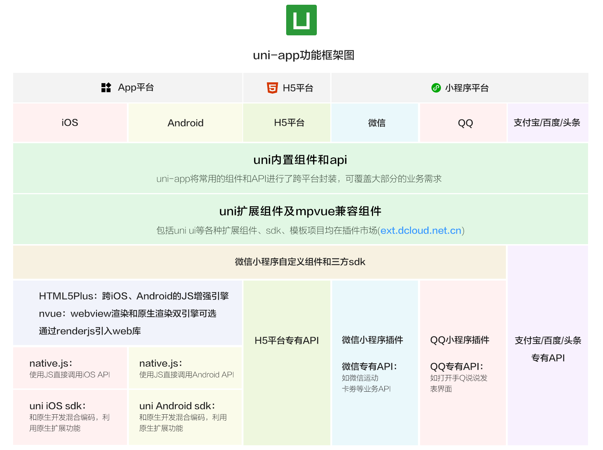

# 熟悉产品的主要特征

\#腾讯课堂#
\#uni-app#
\#uni-app官方教程#
\#产品介绍#
\#熟悉产品的主要特征#

uni-app 背景、特点。

## 背景

1. 多端泛滥
1. 体验不好
1. 生态贫瘠

## 产品特征

1. 跨品台更多  
   保留不同平台特殊功能
1. 运行体验更好  
   组件、ap与微信小程序一致
   兼容 weex 原生渲染
1. 通用技术栈  
   vue的语法、微信小程序的 api
   内嵌 mpvue
1. 开放的生态
    1. 支持 npm
    1. 支持微信小程序自定义组件及 SDK
    1. 兼容 mpvue
    1. app 端支持和原生混合编码
    1. DCloud 插件市场
   
## 框架

## 延伸

* [HTML5+](http://www.html5plus.org/doc/zh_cn/webview.html)