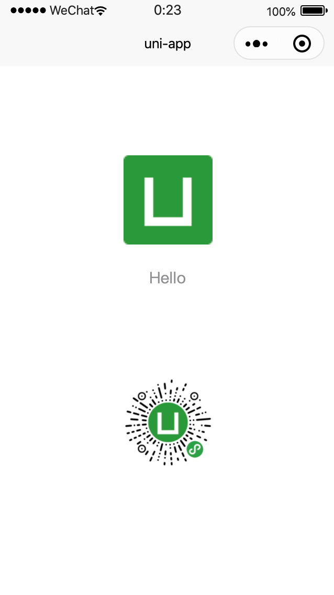
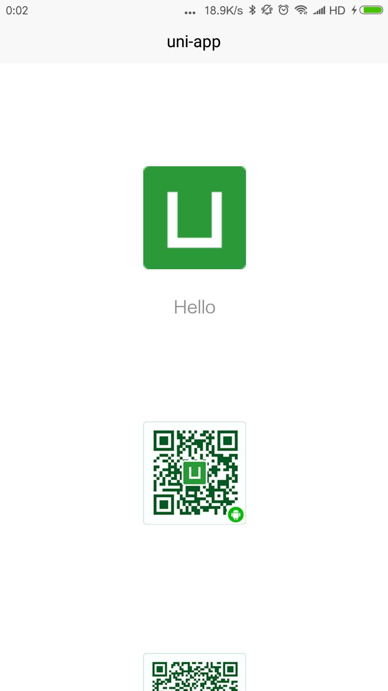

# 快速入门

\#腾讯课堂#
\#uni-app#
\#uni-app官方教程#
\#开发规范#
\#快速入门#

uni-app 搭建环境、创建项目。

## 搭建环境

* 开发工具
  * [HBuilderX](https://www.dcloud.io/hbuilderx.html)
  * [微信开发者工具](https://developers.weixin.qq.com/miniprogram/dev/devtools/download.html)

## [创建项目](https://uniapp.dcloud.io/quickstart?id=%e5%88%9b%e5%bb%bauni-app)

1. 文件 -> 新建 -> 项目
2. 选择 uni-app -> 输入项目名称 -> 输入或选择位置 -> 选择 uni-ui 项目 -> 选择默认模板 -> 创建
3. 目录

  ```
  /
  ├─ components 组件
  ├─ pages 页面
  ├─ static 静态资源
  ├─ App.vue 应用配置（全局生命周期监听、全局样式）
  ├─ main.js 入口文件
  ├─ manifest.json 配置应用信息
  └─ pages.json 记录页面路由、导航条、选项卡等页面信息
  ```

  * [uni-app 组件](https://uniapp.dcloud.io/component/README)
  * [微信开放文档 组件](https://developers.weixin.qq.com/miniprogram/dev/component/)
  * [uni-app 使用 Vue.js 注意事项](https://uniapp.dcloud.io/use)
  * [Vue.js API](https://cn.vuejs.org/v2/api/)
  * [uni-app API](https://uniapp.dcloud.io/api/README)
  * [微信开放文档 API](https://developers.weixin.qq.com/miniprogram/dev/api/)

4. 条件编译

  ```html
  <!-- /pages/index/index.vue -->
  <!-- #ifdef APP-PLUS -->
  <image src="../../static/uni-android.png" mode="widthFix"></image>
  <image src="../../static/uni-ios.png" mode="widthFix"></image>
  <!-- #endif -->
  <!-- #ifdef MP-WEIXIN -->
  <image src="../../static/uni-weixin.jpg" mode="widthFix"></image>
  <!-- #endif -->
  ```

5. 运行 -> 运行到小程序模拟器 -> 微信开发者工具

  

6. 运行 -> 运行到手机或模拟器 -> 运行-\[设备\]

  

7. 发行 -> 原生 App-云打包 -> 下载 -> 安装 -> 运行
8. 发行 -> 配置 AppId -> 微信开发者工具 上传 -> 微信公众平台小程序 -> 开发管理 -> 提交审核

案例

```shell
# HBuilderX
# /project/dcloud-uni-app/uni-app-default
```