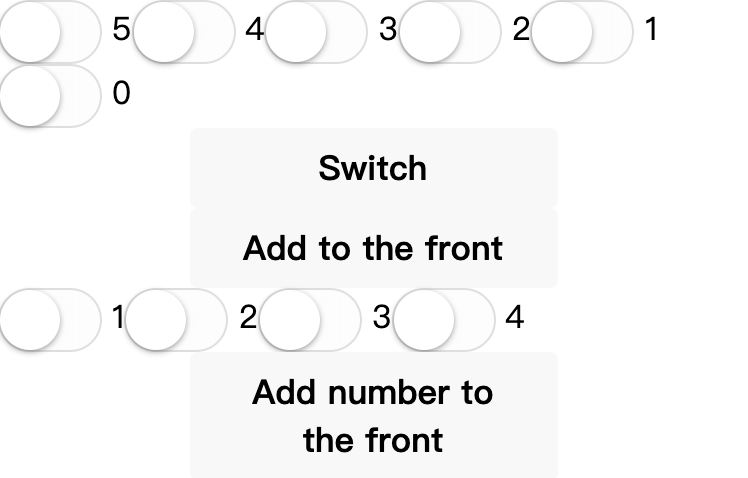

# WXML 模板

\#小程序开发指南#
\#微信小程序团队#
\#代码组成#
\#WXML 模板#
\#微信小程序#

微信小程序 WXML 模板（介绍、数据绑定、逻辑语法、条件逻辑、列表渲染、模板、引用、共同属性）。

## 介绍

* WXML（WeiXin Markup Language）
* 小程序的标签语言
* 后缀名 `.wxml`
* 语法类似 HTML
  
```html
<!-- 在此处写注释 -->
<标签名 属性名1="属性值1" 属性名2="属性值2" ...> ...</标签名>
```

* 要求标签严格闭合
* 属性大小写敏感

## 数据绑定

* 同步数据到用户界面
* WXML 通过 `{{`变量名`}}` 绑定对应 JavaScript 文件中的 `data` 对象属性

```js
// /project/mp-dev-guide/hello/pages/wxml/index.js
Page({
  data: {
    time: (new Date()).toString(),
  },
})
```

```html
<!-- /project/mp-dev-guide/hello/pages/wxml/index.wxml -->
<view>当前时间 {{time}}</view>
<!-- 输出
当前时间 Fri Jun 12 2020 21:00:18 GMT+0800 (中国标准时间)
-->
```

* 属性值的绑定  
  * 包裹在双引号 `"` 中


```html
<!-- /project/mp-dev-guide/hello/pages/wxml/index.wxml -->
<view data-time="{{time}}">当前时间 {{time}}</view>
```

* 变量名大小写敏感

```js
// /project/mp-dev-guide/hello/pages/wxml/index.js
Page({
  data: {
    w: 'w',
    W: 'w',
  },
})
```

```html
<!-- /project/mp-dev-guide/hello/pages/wxml/index.wxml -->
<view>{{w}}</view>
<view>{{W}}</view>
<!-- 输出
w
W
-->
```

* `data` 中未定义的或被设置成 `undefined` 的变量不会同步到 WXML 中

```js
// /project/mp-dev-guide/hello/pages/wxml/index.js
Page({
  data: {
    // var1: '',
    var2: undefined,
    var3: null,
    var4: 'var4',
  },
})
```

```html
<!-- /project/mp-dev-guide/hello/pages/wxml/index.wxml -->
<view>{{var1}}</view>
<view>{{var2}}</view>
<view>{{var3}}</view>
<view>{{var4}}</view>
<!-- 输出
null
var4
-->
```

## 逻辑语法

`{{}}` 内进行简单逻辑运算

* 三元运算

```html
<!-- /project/mp-dev-guide/hello/pages/wxml/index.wxml -->
<view>{{a === 10 ? '变量 a 等于10' : '变量 a 不等于10'}}</view>
<!-- 输出
变量 a 不等于10'
-->
```

* 算数运算

```js
// /project/mp-dev-guide/hello/pages/wxml/index.js
Page({
  data: {
    a: 1,
    b: 2,
  },
})
```

```html
<!-- /project/mp-dev-guide/hello/pages/wxml/index.wxml -->
<view>{{a + b}}</view>
<!-- 输出
3
-->
```

* 字符串拼接

```js
// /project/mp-dev-guide/hello/pages/wxml/index.js
Page({
  data: {
    name: 'World',
  },
})
```

```html
<!-- /project/mp-dev-guide/hello/pages/wxml/index.wxml -->
<view>{{'Hello ' + name}}</view>
<!-- 输出
Hello World
-->
```

* 数字、字符串、数组字面量

```html
<!-- /project/mp-dev-guide/hello/pages/wxml/index.wxml -->
<view>{{1}}</view>
<view>{{'string'}}</view>
<view>{{[1,2,3]}}</view>
<!-- 输出
1
string
1,2,3
-->
```

## 条件逻辑

* `wx:if`
* `wx:elif`
* `wx:else`

```js
// /project/mp-dev-guide/hello/pages/wxml/index.js
Page({
  data: {
    condition: 3,
  },
})
```

```html
<!-- /project/mp-dev-guide/hello/pages/wxml/index.wxml -->
<view wx:if="{{condition > 3}}">3</view>
<view wx:elif="{{condition > 2}}">2</view>
<view wx:else="{{condition > 1}}">1</view>
<!-- 输出
2
-->
```

## 列表渲染

* `wx:for` 绑定数组
* 下标默认变量名 `index`
* 当前项默认变量名 `item`

```js
// /project/mp-dev-guide/hello/pages/wxml/index.js
Page({
  data: {
    list: [
      { message: 'foo' },
      { message: 'bar' },
    ],
  },
})
```

```html
<!-- /project/mp-dev-guide/hello/pages/wxml/index.wxml -->
<view wx:for="{{list}}" wx:key="message">{{index}}: {{item.message}}</view>
<!-- 输出
0: foo
1: bar
-->
```

* `wx:for-item` 指定当前项变量名
* `wx:for-index` 指定下标变量名

```html
<!-- /project/mp-dev-guide/hello/pages/wxml/index.wxml -->
<view wx:for="{{list}}" wx:for-item="itemName" wx:for-index="idx" wx:key="message">{{idx}}: {{itemName.message}}</view>
<!-- 输出
0: foo
1: bar
-->
```

* `wx:key` 指定列表中项目的唯一标识符
* 当列表中项目会改变或添加新的项目，希望项目保持自己的特性、状态，被重新排序而不是重新创建，提高渲染效率
* 形式
  * 字符串  
    如对象类型列表项目的某个属性，需要是唯一的
  * 保留关键字 `this` 代表列表项目本身  
    需要列表项目本身是唯一的字符串或数字

```js
// /project/mp-dev-guide/hello/pages/wxml/index.js
Page({
  data: {
    objectArray: [
      { id: 5, unique: 'unique_5' },
      { id: 4, unique: 'unique_4' },
      { id: 3, unique: 'unique_3' },
      { id: 2, unique: 'unique_2' },
      { id: 1, unique: 'unique_1' },
      { id: 0, unique: 'unique_0' },
    ],
    numberArray: '1234'.split(''),
  },

  switch() {
    const length = this.data.objectArray.length
    for (let i = 0; i < length; i++) {
      const x = Math.floor(Math.random() * length)
      const y = Math.floor(Math.random() * length)
      const temp = this.data.objectArray[x]
      this.data.objectArray[x] = this.data.objectArray[y]
      this.data.objectArray[y] = temp
    }
    this.setData({
      objectArray: this.data.objectArray,
    })
  },
  addToFront() {
    const length = this.data.objectArray.length
    this.data.objectArray.unshift({ id: length, unique: `unique_${length}` })
    this.setData({
      objectArray: this.data.objectArray,
    })
  },
  addNumberToFront() {
    this.data.numberArray.unshift(this.data.numberArray.length + 1)
    this.setData({
      numberArray: this.data.numberArray,
    })
  },
})
```

```html
<!-- /project/mp-dev-guide/hello/pages/wxml/index.wxml -->
<view>
  <switch wx:for="{{objectArray}}" wx:key="unique">{{item.id}}</switch>
  <button bindtap="switch">Switch</button>
  <button bindtap="addToFront">Add to the front</button>

  <switch wx:for="{{numberArray}}" wx:key="*this">{{item}}</switch>
  <button bindtap="addNumberToFront">Add number to the front</button>
</view>
```



## 模板

* `<template>` 模板  
  内部定义代码片段以调用  
  `name` 属性作为模板名字  
  `is` 属性对应 `name` 的模板  
  `data` 传入参数

```js
// /project/mp-dev-guide/hello/pages/wxml/index.js
Page({
  data: {
    msgItem: {
      index: 0,
      msg: 'this is a template',
      time: '2020-01-01',
    },
  },
})
```

```html
<!-- /project/mp-dev-guide/hello/pages/wxml/index.wxml -->
<template name="msgItem">
  <view>
    <text>{{index}}: {{msg}}</text>
    <text> Time: {{time}}</text>
  </view>
</template>
<template is="msgItem" data="{{...msgItem}}"></template>
<!-- 输出
0: this is a template Time: 2020-01-01
-->
```

* 动态模板

```html
<!-- /project/mp-dev-guide/hello/pages/wxml/index.wxml -->
<template name="odd">
  <view>odd</view>
</template>
<template name="even">
  <view>even</view>
</template>
<block wx:for="{{[1, 2, 3, 4, 5]}}" wx:key="*this">
  <template is="{{item % 2 == 0 ? 'even' : 'odd'}}"></template>
</block>
<!-- 输出
odd
even
odd
even
odd
-->
```

## 引用

* `import`
  * 有作用域概念  
    只 `import` 目标文件中定义的 `<template>`  
    而不会 `import` 目标文件中 `import` 的 `<template>`  
    不具有递归特性

```html
<!-- /project/mp-dev-guide/hello/pages/wxml/item.wxml -->
<template name="item">
  <view>{{text}}</view>
</template>
```

```html
<!-- /project/mp-dev-guide/hello/pages/wxml/index.wxml -->
<import src="item.wxml" />
<template is="item" data="{{text: 'forbar'}}"></template>
<!-- 输出
forbar
-->
```

```html
<!-- /project/mp-dev-guide/hello/pages/wxml/A.wxml -->
<template name="A">
  <view>A template</view>
</template>
```

```html
<!-- /project/mp-dev-guide/hello/pages/wxml/B.wxml -->
<import src="A.wxml" />
<template name="B">
  <view>B template</view>
</template>
```

```html
<!-- /project/mp-dev-guide/hello/pages/wxml/index.wxml -->
<import src="B.wxml" />
<template is="A"></template><!-- 警告 Template `A` not found. -->
<template is="B"></template>
<!-- 输出
B template
-->
```

* `include`  
  引入除了 `<template/>`、`<wxs/>` 外的代码  
  相当于拷贝

```html
<!-- /project/mp-dev-guide/hello/pages/wxml/header.wxml -->
<view>header</view>
```

```html
<!-- /project/mp-dev-guide/hello/pages/wxml/footer.wxml -->
<view>footer</view>
```

```html
<!-- /project/mp-dev-guide/hello/pages/wxml/index.wxml -->
<include src="header.wxml" />
<view>body</view>
<include src="footer.wxml" />
<!-- 输出
header
body
footer
-->
```

## 共同属性

* 所有 wxml 标签都支持的属性

| 属性名            | 类型         | 描述       | 注解                        |
| ---------------- | ------------ | ---------- | ------------------------- |
| `id`             | String       | 唯一标识   | 整个页面唯一                 |
| `class`          | String       | 样式类     | 对应 WXSS 样式类             |
| `style`          | String       | 内联样式   | 可动态设置                   |
| `hidden`         | Boolean      | 是否显示   | 默认显示                     |
| `data-*`         | Any          | 自定义属性 | 触发事件时，会发送给事件处理函数 |
| `bind*`/`catch*` | EventHandler | 事件       |                            |

## 实例

```shell
# /project/mp-dev-guide/hello WXML 模板
```
