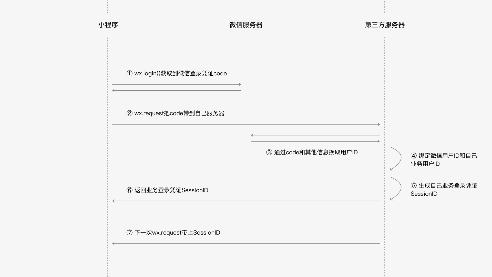

# 微信登录

\#小程序开发指南#
\#微信小程序团队#
\#应用场景#
\#微信登录#
\#微信小程序#

微信小程序 微信登录（获取微信登录凭证 code、发送 code 到开发者服务器、到微信服务器换取微信用户身份 id、绑定微信用户身份 id 和业务用户身份）。

* 获取微信登录态
* 打通微信账号与自己的账号



## 获取微信登录凭证 code

* `wx.login` 生成5分钟时效性的凭证
* 后台根据凭证从微信后台服务器获取微信用户 id

## 发送 code 到开发者服务器

* `wx.login` `success` 回调返回微信登录凭证，`wx.request` 传微信登录凭证、账号、密码
* 开发者服务器校验账号密码，和微信用户 id 绑定

```js
// page.js
Page({
  tapLogin: function() {
    wx.login({
      success: function(res) {
        if (res.code) {
          wx.request({
            url: 'https://test.com/login',
            data: {
              username: 'zhangsan', // 用户输入的账号
              password: 'pwd123456', // 用户输入的密码
              code: res.code
            },
            success: function(res) {
              // 登录成功
              if (res.statusCode === 200) {
               console.log(res.data.sessionId)// 服务器回包内容
              }
            },
          })
        } else {
          console.log('获取用户登录态失败！' + res.errMsg)
        }
      },
    })
  },
})
```

## 到微信服务器换取微信用户身份 id

* 开发者后台传微信登录凭证 code、AppId、AppSecret 到微信服务器换取微信用户身份
* code 成功换取一次信息后立即失效，即便还没过期
* 微信服务器地址  
  `https://api.weixin.qq.com/sns/jscode2session?appid=<AppId>&secret=<AppSecret>&js_code=<code>&grant_type=authorization_code`
* jscode2session 返回字段

| 字段           | 描述                                                      |
| ------------- | --------------------------------------------------------- |
| `openid`      | 微信用户 id 唯一标识                                        |
| `session_key` | 会话密钥，可以请求微信服务器其他接口获取信息，不应该下放到前端      |
| `unionid`     | 用户在微信开放平台的唯一标识符。本字段在满足一定条件的情况下才返回。 |

## 绑定微信用户身份 id 和业务用户身份

* 开发者后台通过校验用户名密码获得业务侧的用户身份 id，通过 code 到微信服务器获得微信侧的用户身份 openid
* 把两个信息的对应关系“绑定”保存起来
* 下次需要用户登录的时候可以不需要输入账号、密码。通过 `wx.login` 获得的 code 到微信服务器获得 openid，通过绑定信息获得业务的的用户身份 id

## 业务登录凭证 SessionId

* 开发者服务器与开发者小程序会话密钥
* 用户登录成功后开发者服务器生成会话秘钥 SessionId 并返回给小程序
* 小程序后续发送请求携带 SessionId 开发者服务器可以通过 SessionId 查询到当前登录用户的身份
