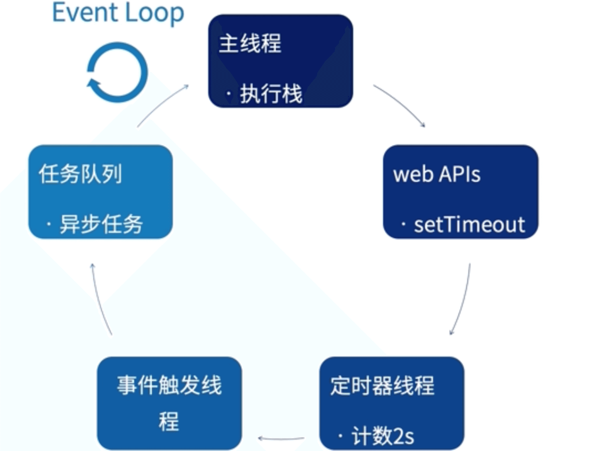
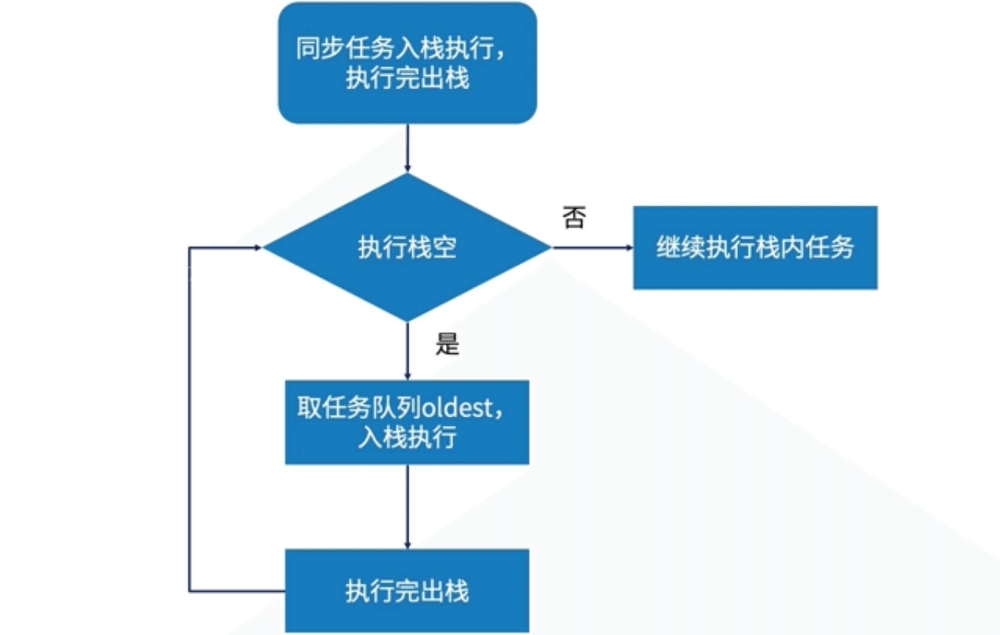
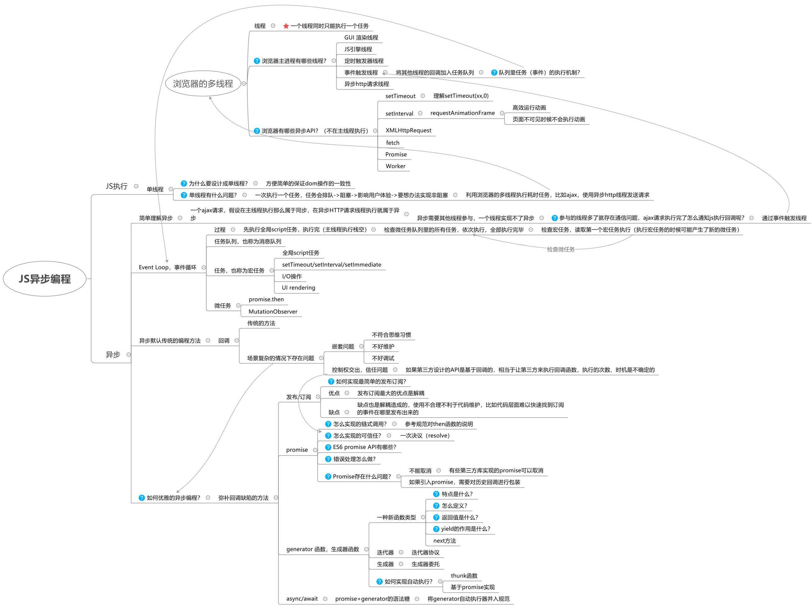

# 理解异步

\#网易云课堂#
\#高级前端开发工程师#
\#Javascript 进阶#
\#异步编程#
\#理解异步#
\#JavaScript#
\#js#

同步、异步、进程、线程、JavaScript 单线程、定时器。

## 同步、异步

* 同步
  * 调用之后得到结果再干别的任务
  * 实例
  
    ```js
    const test = () => {
      let t = +new Date()
      while (true) {
        if (+new Date() - t >= 2000) { break }
      }
    }
    console.log(1)
    test()
    console.log(2)
    console.log(3) // 1 2s 后2 3
    ```

* 异步
  * 调用之后先不管结果继续干别的任务
  * 实例

    ```js
    console.log(1)
    setTimeout(() => { console.log(2) }, 2000)
    console.log(3) // 1 3 2s 后 2
    ```

## 进程、线程

* 进程
  * 程序运行的实例
  * 统一程序可以产生多个进程
  * 一个进程包含一个或多个线程
  * 命令

    ```shell
    # 查看进程状态 process status
    ps
    # 查看动态进程变化 table of process
    top
    ```

* 线程
  * 操作系统能够进行运算调度的最小单位
  * 一次只能执行一个任务
  * 有自己的调用栈、寄存器环境
  * 同一进程的线程共享进程资源

## JavaScript 单线程

* 通过**浏览器内核多线程**实现异步

### 浏览器进程


* 渲染线程
  * GUI 线程
    * 渲染布局
    * 解析 html css
    * 构建、渲染 DOM 树
  * JS 引擎线程
    * 解析、执行 js
    * 只有一个  
      js 是单线程的
    * 与 GUI 线程互斥
  * 定时器触发线程
    * setTimeout
    * setInterval
  * 事件触发线程
    * 将满足触发条件的事件放入任务队列
  * 异步 HTTP 请求线程
    * xhr

### 异步场景

* 定时器
* 网络请求
* 事件绑定
* ES6 Promise

## 定时器



1. 调用 webAPI
1. 定期线程计数 2s
1. 事件触发线程将定时器事件放入任务队列
1. 主线程通过 Event Loop 遍历任务队列



### 问题

* 定时任务可能不会按时执行  
  会等同步任务执行完成后执行
  * 实例

    ```js
    const test = () => {
      let t = +new Date()
      while (true) {
        if (+new Date() - t >= 5000) { break }
      }
    }
    setTimeout(() => console.log(1), 2000) // 5s 后 2
    test()
    ```
* 定时器嵌套5次之后最小间隔不能低于4ms

### 场景

* 防抖
* 节流
* 倒计时
* 动画

### 实例

```js
// var 函数作用域，没有块级作用域
for (var i = 1; i <= 10; i++) {
  setTimeout(() => console.log(i), 1000 * i)
}
// 每 1s 11
for (var i = 1; i <= 10; i++) {
  (function (i) {
    setTimeout(() => console.log(i), 1000 * i)
  })(i)
}
// 每 1s 1 递增
// let 块级作用域
for (let i = 1; i <= 10; i++) {
  setTimeout(() => console.log(i), 1000 * i)
}
// 每 1s 1 递增
```

### 知识点



## 延伸

* [浏览器进程？线程？傻傻分不清楚！ - coverguo](https://imweb.io/topic/58e3bfa845e5c13468f567d5)
* [定时器标准 - HTML Standard](https://html.spec.whatwg.org/multipage/timers-and-user-prompts.html#timers)