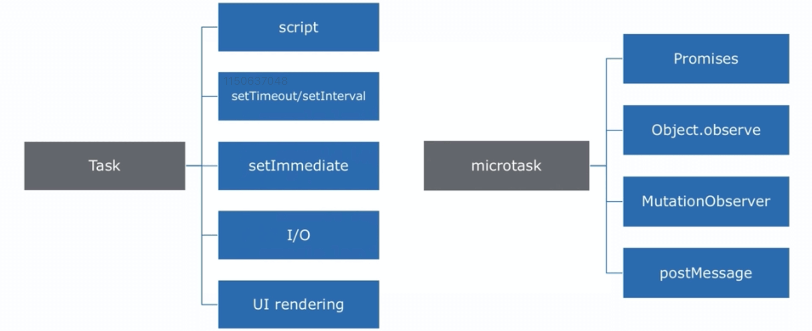

# Event Loop 机制

\#网易云课堂#
\#高级前端开发工程师#
\#Javascript 进阶#
\#异步编程#
\#Event Loop 机制#
\#JavaScript#
\#js#

浏览器的 Event Loop（异步实现、宏任务、微任务、运行过程）、Node.js 的 Event Loop（架构、阶段、nextTick）

## 浏览器的 Event Loop

### 异步实现
  * 宏观  
    浏览器多线程
  * 微观  
    Event Loop
* 实例

  ```js
  console.log(1)
  setTimeout(() => { console.log(2) })
  Promise.resolve().then(() => { console.log(3) })
  setTimeout(() => { console.log(4) })
  Promise.resolve().then(() => { console.log(5) })
  console.log(6)
  // 1 6 3 5 2 4
  ``` 

  * task queue 执行 script // 1 6
  * microtask queue 清空任务 Promise // 3 5
  * task queue 执行 第1个 setTimeout // 2
  * task queue 执行 第2个 setTimeout // 4

### 宏任务、微任务



* Macro Task（宏）任务
  * script 脚本
  * setTimeout/setInterval 定时器
  * setImmediate
  * I/O
  * UI rendering
* Micro Task 微任务
  * Promise
  * Object.observe 监听对象变化
  * MutationObserve 监听 DOM 结构变化
  * postMessage window 间通讯

### 运行过程


* 执行微任务是全部执行、清空
* 一个 Event Loop 有一个或多个 task queue  
  每个 Event Loop 有一个 microtask queue
* requestAnimationFrame 处于渲染阶段

* 实例

  ```js
  console.log('start')
  setTimeout(() => {
    console.log('setTimeout')
    new Promise((resolve) => {
      console.log('promise 1')
      resolve()
    }).then(() => console.log('promise then 1'))
  }, 0)
  new Promise((resolve) => {
    console.log('promise 2')
    resolve()
  }).then(() => console.log('promise then 2'))
  new Promise((resolve) => {
    console.log('promise 3')
    resolve()
  }).then(() => console.log('promise then 3'))
  // start
  // promise 2
  // promise 3
  // promise then 2
  // promise then 3
  // setTimeout
  // promise 1
  // promise then 1
  ```

  * `new Promise()` 同步执行

  ```js
  async function async1() {
    console.log('async1 start')
    await async2()
    console.log('async1 end')
  }
  async function async2() {
    return Promise.resolve().then(() => console.log('async2 promise'))
  }

  console.log('start')
  setTimeout(() => console.log('setTimeout'), 0)
  async1()
  new Promise((resolve) => {
    console.log('promise 1')
    resolve()
  }).then(() => console.log('promise then 1'))
  // start
  // async1 start
  // promise 1
  // async2 promise
  // promise then 1
  // async1 end
  // setTimeout
  ```

## Node.js 的 Event Loop

### 架构


* node-core  
  核心库
* 绑定  
  * 包装、暴露 libuv、js
* V8  
  js 引擎
* libuv  
  * 第三方事件驱动库
  * c 语言
  * I/O 引擎
  * 负责 node API 执行  
    分配不同任务给不同的线程形成 Event Loop  
    异步形式返回结果给 V8 引擎
  * Node.js 是非阻塞的 I/O 单线程  
    非阻塞由 libuv 实现

### 阶段


1. timers  
   执行 timer 的回调
1. pending callbacks  
   系统操作的回调
1. idle、prepare  
   内部使用
1. poll  
   等待新 I/O 事件
1. check  
   执行 setImmediate 回调
1. close callbacks  
   内部使用

* Event Loop 运行到制定阶段，该阶段的 fifo 队列会被执行  
  当队列 callback 执行完或超过上限  
  则进入下一阶段

#### poll 阶段


* poll 阶段
  1. 计算应该被 block 多久
  1. 处理 poll 队列事件

### process.nextTick()

* 异步的 node API
* 不属于 Event Loop 阶段
* 先执行该方法回调

### 实例

```js
// /project/netease-study-senior-fe/event-loop/block.js
// node block.js
const fs = require('fs')

function someAsyncOperation(callback) {
  fs.readFile(__dirname, callback)
}
const timeoutScheduled = Date.now()
setTimeout(() => {
  const delay = Date.now() - timeoutScheduled
  console.log(`${delay}ms have passed since I was scheduled`)
}, 100)
someAsyncOperation(() => {
  const startCallback = Date.now()
  while (Date.now() - startCallback < 200) {
    // do nothing
  }
})
// 204ms have passed since I was scheduled
```

* poll 队列阻塞 200ms 才会检查 timer

```js
// /project/netease-study-senior-fe/event-loop/immediate.js
// node immediate.js
const fs = require('fs')

fs.readFile(__filename, _ => {
  setTimeout(_ => {
    console.log('setTimeout')
  }, 0)
  setImmediate(_ => {
    console.log('setImmediate')
  })
})
// setImmediate setTimeout
```

```js
// /project/netease-study-senior-fe/event-loop/nextTick.js
// node nextTick.js
const fs = require('fs')

fs.readFile(__filename, _ => {
  setTimeout(_ => {
    console.log('setTimeout')
  }, 0)
  setImmediate(_ => {
    console.log('setImmediate')
    process.nextTick(_ => {
      console.log('nextTick2')
    })
  })
  process.nextTick(_ => {
    console.log('nextTick1')
  })
})
// nextTick1 setImmediate nextTick2 setTimeout
```

## 延伸

* [Event Loops 标准 - HTML Standard](https://html.spec.whatwg.org/multipage/webappapis.html#event-loops)
* [Node.js 事件循环，定时器和 process.nextTick() - Node.js](https://nodejs.org/zh-cn/docs/guides/event-loop-timers-and-nexttick/#what-is-the-event-loop)
* [调用栈 - MDN](https://developer.mozilla.org/zh-CN/docs/Glossary/Call_stack)
* [「前端进阶」JS中的栈内存堆内存 - 云中桥](https://juejin.im/post/5d116a9df265da1bb47d717b)
* [带你彻底弄懂Event Loop - liuxuan](https://segmentfault.com/a/1190000016278115)