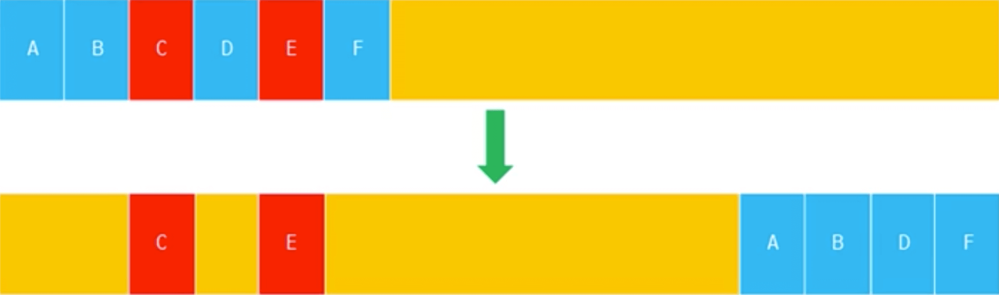

# JavaScript 中内存管理

\#网易云课堂#
\#高级前端开发工程师#
\#Javascript 进阶#
\#函数#
\#javascript 中内存管理#
\#JavaScript#
\#js#

为什么学习内存、JS 数据类型、JS 内存机制、垃圾回收机制、V8 引擎内存管理机制。

## 为什么学习内存

* 程序运行需要内存分配空间。
* 防止页面占用内存过大，导致客户端卡顿、无响应
* Node.js 使用 V8 引擎，内存对后端服务的性能至关重要。  
  因为后端服务的持久性，更容易造成内存溢出。

## JS 数据类型

### 原始数据类型

* 字符串 String
* 数字 Number
* 布尔 Boolean
* 空对象 Null
* 未定义 Undefined
* Symbol

### 引用数据类型

* 对象 Object

## JS 内存机制

### 栈内存 Stack

* 运算受限的线性表  
  仅允许在表的一端（栈顶）进行插入、删除运算
  * 入栈（进栈、压栈）  
    放在栈顶元素上使其成为新的栈顶元素
  * 出栈（退栈）  
    删除栈顶元素使其相邻元素成为新的栈顶元素
* 原始数据类型值有固定大小  
  系统自动分配存储空间
* 存储原始数据类型

### 堆内存 Heap

* 引用数据类型值大小不固定
* 存储引用数据类型
* js 不允许直接访问堆内存、操作堆内存空间  
  需要操作引用（可以理解为存储在栈内存中的内存地址，与堆内存中的实际值相关联）

### 定义原始数据类型变量 `let a = 10;`

* `10` 存入内存空间
* 当前作用域中声明变量 `a`  
  `a` 的值为 `undefined`
* `a` 与 `10` 进行关联

### 存储对象 `let obj1 = { a: 10 };`

* 堆内存中开辟一块空间  
  以键值对的形式存储对象  
  对应一个内存地址
* 栈内存中声明变量 `obj1`  
  关联的值是堆内存中的内存地址  
  可以通过该变量访问对象了

### 声明函数 `function fn () {}`

* 堆内存中开辟一块空间  
  以字符串的形式存储函数体中的代码
  对应一个内存地址
* 讲堆内存的内存地址赋值给栈内存中声明函数名变量 `fn`  
  函数任以字符串的形式存储在堆内存中

```js
function fn() { return 1; } // undefined
fn // ƒ fn() { return 1; }
fn() // 1
```

## 垃圾回收机制

* 垃圾回收
  * 找出不再继续使用的变量，释放其所占用的内存
  * 垃圾回收器周期性执行垃圾回收
  * 自动执行
  * 不可见的
* 优势
  * 简化内存管理代码  
    减低负担
* 劣势
  * JavaScript 未暴露内存 API  
    无法干预内存管理
* 目的
  * 了解垃圾回收机制有助于编写更优秀的代码

## 垃圾收集策略

### 引用计数（reference counting）  

* 跟踪值被引用次数，每次引用+1，释放减-1，当值的引用次数变成0时，回收其内存空间

```js
// 声明一个变量并给其赋值一个引用类型的值
// 则该引用类型的值的引用次数为1
let obj = { a: 10 };
// 同一个引用类型的值被赋值给另一个变量
// 则该引用类型的值的引用次数+1
let obj1 = { a: 10 };
// 当变量被赋值另一个值
// 则该引用类型的值得引用次数-1
let obj = {};
// 当变量被赋值 null，解除了应用类型的引用
// 此时该引用类型的值的引用次数为0，无法再访问该引用类型的值
// 当垃圾回收机制运行的时候就会释放该引用类型的值所占用的空间
let obj = null;
```

* 缺点  
  循环引用（相互引用）造成无法回收内存  
  IE8- 浏览器会出现的问题

```js
// 循环引用
let obj = { a: 10 };
obj.b = obj;
```

### 标记清除

* 当变量进入执行环境时标记为“进入环境”，当变量离开环境时标记为“离开环境”  
  垃圾收集器完成内存清除，销毁带标记的值，回收其所占用的内存空间
* 执行环境  
  定义了变量或函数有权访问的其他数据，决定了各自的行为  
  每个执行环境都有一个变量对象（variable object），以存储所有定义的变量和函数。代码无法访问，由解析器使用
* 全局执行环境  
  * 最外围的执行环境
  * 浏览器中是 window  
    node 中是 global
  * 执行环境中所有代码执行完毕后，该环境被销毁，其中所有变量和函数的定义也被销毁
  * 全局执行环境直到应用程序退出、关闭网页、关闭浏览器时被销毁
* 局部执行环境（环境栈）
  * 每个函数都有自己的执行环境
  * 当指令流进入一个函数时，函数的环境就会被退出一个环境栈中。  
    当函数执行后，栈将其环境弹出，把控制权返还给之前的执行环境。
  * ECMAScript 程序中的执行流由此机制控制。

  ```js
  function fn() {
    var a = 10; // 被标记进入环境
    var b = 'hello'; // 被标记进入环境
  }
  // 执行完毕
  // a、b 被标记离开环境，内存被回收
  fn();
  ```

* 目前主流浏览器使用标记清除

## V8 内存管理机制

### 限制内存

* 64位系统约为 1.4G，32位系统约 0.7G
* 原因
  * 最初为浏览器设计，不大可能存在大量内存使用场景
  * 防止垃圾回收所导致的线程暂停执行时间过长
* 可以修改内存限制设置
* 使用 Buffer 对象（c++ 层面分配内存）

### 回收策略

* 分代回收  
  新生代、老生代
* 新生代（Scavenge 的 Cheney 算法）
  * 存储存活时间较短的对象
  * 将堆内存分成2个 semispace 空间，处于使用状态的 from 空间存储不需要被回收的对象，处于闲置状态的 to 空间存储需要被回收的对象
    
* 老生代（Mark-Sweep（标记清除）、Mark-Compact（标记合并））
  * 存储存活时间常或常驻内存对象
  * 内存空间是一个连续的结构
  * Mark-Sweep（标记清除）  
    将需要回收的对象进行标记，在垃圾回收运行时直接释放对应的内存空间  
    垃圾回收后产生内存不连续的问题
    
  * Mark-Compact（标记合并）  
    将存活的对象移动到一边，将需要被回收的对象移动到另一边，对需要被回收的对象区域做整体的垃圾回收
    
* 新生代对象的晋升
  * 新生代对象移动到老生代进行管理
  * 当一个对象多次景经过复制后依然存活，将被认为生命周期较长的对象晋升
  * 在 from 空间、to 空间反转时，如果 to 空间使用量超过 25%，将 from 空间中的对象晋升