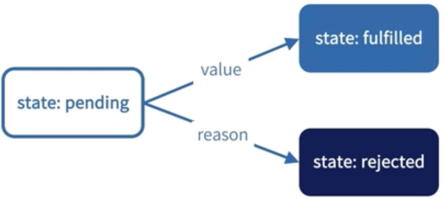
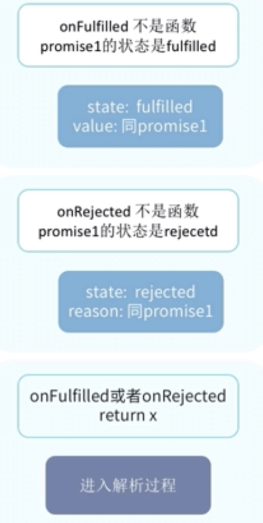

# 异步编程方法 - 深入理解 promise

\#网易云课堂#
\#高级前端开发工程师#
\#Javascript 进阶#
\#异步编程#
\#异步编程方法 - 深入理解 promise#
\#JavaScript#
\#js#

Promise 规范、ES6 Promise API、Promise 实践。

## Promise/A+ 规范

* 术语
  * promise  
    有 `then` 方法的对象或函数，行为符合本规范
  * thenable  
    定义了 `then` 方法的对象或函数
  * 值，`value`  
    JavaScript 合法值
  * 异常，`exception`  
    `throw` 语句抛出的值
  * 拒绝原因，`reason`  
    标示 promise 被拒绝原因的值
* 要求
  * promise 状态
    * pending
    * fulfilled
    * rejected

    

    * pending 状态可以转换成 fulfilled、rejected 状态
    * fulfilled、rejected 状态时是稳定的无法改变状态
  * `then` 方法
    * `const promise2 = promise1.then(onFulfilled, onRejected)`
    * 参数
      * onFulfilled  
        在 Promise 完成后被调用
      * onRejected  
        在 Promise 配拒绝执行后被调用
      * 只能调用一次
    * 可以多次调用
    * 返回值 Promise

    

    * 解析过程
      * 抽象模型 resolve(promise, x)
      * 如果 promise、x 指向相同的值
      * 如果 x 是 promise
      * 如果 x 是对象或函数
      * 如果 x 不是对象也不是函数
* 实例
  
  ```js
  const promise = new Promise((resolve, reject) => {
    console.log(1)
    resolve()
    console.log(2)
  })
  promise.then(() => console.log(3))
  console.log(4)
  // 1 2 4 3
  ```

  ```js
  const promise = Promise
    .resolve(1)
    .then(2)
    .then(Promise.resolve(3))
    .then(console.log)
  // 1
  // 分解
  const promise1 = Promise.resolve(1)
  const promise2 = promise1.then(2)
  const promise3 = promise2.then(Promise.resolve(3))
  const promise4 = promise3.then(console.log)
  ```

## ES6 Promise API

### 构造函数

<table>
<thead>
  <tr>
    <th>构造函数</th>
    <th>说明</th>
  </tr>
</thead>
<tbody>
  <tr>
    <td>
      new Promise(function (resolve, reject) {<br>// resolve(value)<br>// reject(reason)<br>})
    </td>
    <td>resolve 函数将 Promise 状态从 pending 变成 fulfilled（resolved）<br>reject 函数将 Promise 状态从 pending 变成 rejected</td>
  </tr>
</tbody>
</table>

### 静态方法

| 方法                               | 说明                                                           |
| ---------------------------------- | ------------------------------------------------------------ |
| Promise.resolve(param)             | 等同于 new Promise((resolve, reject) => resolve(param))       |
| Promise.reject(reason)             | 等同于 new Promise((resolve, reject) => reject(reason))       |
| Promise.all([p1, ..., pn])         | 返回 promise，所有 promise 都是 fulfilled 结果才是 fulfilled 状态 |
| Promise。allSettled([p1, ..., pn]) | 返回 promise，所有 promise 状态盖面后结果才是 fulfilled 状态       |
| Promise.race([p1, ..., pn])        | 返回 promise，状态为第一个改变状态的 promise 的状态                |

### 实例方法

| 方法                                  | 说明                                       |
| ------------------------------------- | ----------------------------------------- |
| promise.then(onFulfilled, onRejected) | promise 状态改变后回调，返回新 promise        |
| promise.catch((reason) => {})         | promise 状态为 rejected 回调，返回新 promise |
| promise.finally((reason) => {})       | promise 状态改变后回调                      |

### 注意

* `then`、`catch` 返回新 promise
* Promise 的错误会“冒泡”

## Promise 实践

```js
// 3s 后亮红灯
// 2s 后亮绿灯
// 1s 后亮黄灯
/**
 * 亮灯
 * @param {string} color 颜色
 * @param {number} second 秒数
 */
let light = (color, second) => new Promise(function (resolve) {
  setTimeout(() => {
    console.log(color)
    resolve()
  }, second * 1000)
})
/**
 * 设置灯
 * @param {Array} lights 灯
 */
let setLight = (lights) => {
  let promise = Promise.resolve()
  lights.forEach((l) => {
    promise = promise.then(() => light(l.color, l.second))
  })
  promise.then(() => setLight(lights))
}
setLight([
  { color: 'red', second: 3 },
  { color: 'green', second: 2 },
  { color: 'yellow', second: 1 },
])
// red green yellow 循环
```

## 延伸

* [Promise - MDN](https://developer.mozilla.org/zh-CN/docs/Web/JavaScript/Reference/Global_Objects/Promise)
* [Promise/A+ 规范 - promises-aplus](https://github.com/promises-aplus/promises-spec)
* [Promise/A+ 规范测试工具 - promises-aplus](https://github.com/promises-aplus/promises-tests)