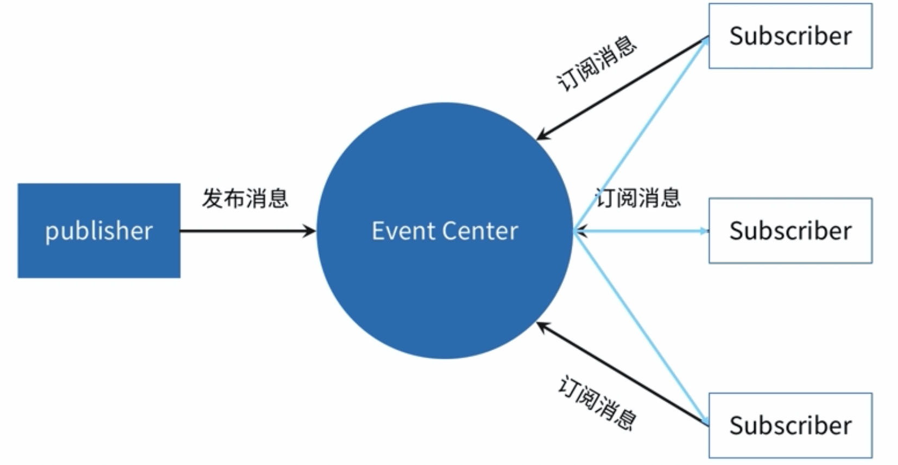

# 异步编程方法 - 发布/订阅

\#网易云课堂#
\#高级前端开发工程师#
\#Javascript 进阶#
\#异步编程#
\#异步编程方法 - 发布/订阅#
\#JavaScript#
\#js#

发布/订阅、实现发布/订阅、Node.js 发布/订阅。

## 发布/订阅


* 回调函数

  ```js
  function ajax(url, callback) {
    // 实现 ajax 请求...
  }
  ajax('./test1.json', (data) => {
    console.log(data)
    ajax('./test2.json', (data) => {
      console.log(data)
      ajax('./test3.json', (data) => console.log(data) )
    })
  })
  ```

  * 缺点
    * 函数嵌套
    * 高耦合
* 发布/订阅

  ```js
  function ajax(url, callback) {
    // 实现 ajax 请求...
  }
  const pbb = new PubSub() // 实现发布/订阅
  ajax('./test1.json', (data) => pbb.publish('test1Success', data) )
  pdd.subscribe('test1Success', (data) => {
    console.log('data')
    ajax('./test2.json', (data) => pbb.publish('test2Success', data) )
  })
  pbb.subscribe('test2Success', (data) => {
    console.log('data')
    ajax('./test3.json', (data) => pbb.publish('test3Success', data) )
  })
  pbb.subscribe('test2Success', (data) => console.log(data) )
  ```
  * 优点
    * 低耦合
    * 灵活
  * 缺点
    * 无法确定消息被触发、触发次数



## 实现发布/订阅

* 事件中心存储事件
* 发出事件
* 订阅事件
* 取消订阅

```js
class PubSub {
  constructor() {
    this.events = {}
  }
  publish(eventName, data) {
    if (!this.events[eventName]) { return }
    this.events[eventName].forEach((cb) => cb.apply(this, data))
  }
  subscribe(eventName, cb) {
    this.events[eventName] = this.events[eventName] || []
    this.events[eventName].push(cb)
  }
  unSubscribe(eventName, cb) {
    if (!this.events[eventName]) { return }
    this.events[eventName] = this.events[eventName].filter((_cb) => _cb !== cb)
  }
}
```

## Node.js 发布/订阅

* `EventEmitter`
  * 封装事件触发与事件监听
  * `const { EventEmitter } = require('events')`
  * 产生事件的对象都是 `events.EventEmitter` 的实例
  * 方法 `emit`、`on`、`once`、`addListener`、`removeListener`

## 延伸

* [EventEmitter 实现源码](https://github.com/nodejs/node/blob/master/lib/events.js)
* [FsWatch 实现源码](https://github.com/nodejs/node/blob/master/lib/internal/fs/watchers.js)