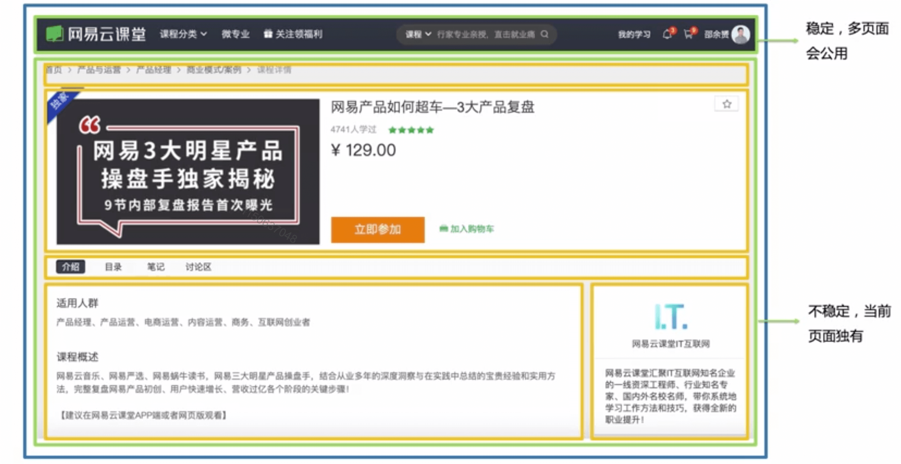

# 组件通信

\#网易云课堂#
\#高级前端开发工程师#
\#Vue#
\#探索 vue 的组件世界#
\#组件通信#
\#JavaScript#
\#js#
\#vue.js#

Vue.js 组建通信、组件跨层级访问（访问外层组件、定向消息、ref）、依赖注入、组件二次封装（`vm.$attrs`、`vm.$listeners`）。

## 组件设计



* Layout
  * Nav
  * Content
    * Breadcrumbs
    * CourseCover
    * CourseTab
    * CourseInfo
    * TeacherInfo
  * Footer

## 组件跨层级访问

### 访问外层组件

* [`vm.$emit`](https://cn.vuejs.org/v2/api/index.html#vm-emit) 触发事件
* [`vm.$root`](https://cn.vuejs.org/v2/api/index.html#vm-root) 根组件
* [`vm.$parent`](https://cn.vuejs.org/v2/api/index.html#vm-parent) 父组件
* `vm.$root`、`vm.$parent` 在各个生命周期钩子中都可使用
* 缺点：强耦合

### 定向消息

```js {3,7}
// https://github.com/ElemeFE/element/blob/dev/src/mixins/emitter.js
dispatch(componentName, eventName, params) {
  var parent = this.$parent || this.$root;
  var name = parent.$options.componentName;

  while (parent && (!name || name !== componentName)) {
    parent = parent.$parent;

    if (parent) {
      name = parent.$options.componentName;
    }
  }
  if (parent) {
    parent.$emit.apply(parent, [eventName].concat(params));
  }
}
```

### ref

* [`ref`](https://cn.vuejs.org/v2/api/index.html#ref)
* [`vm.refs`](https://cn.vuejs.org/v2/api/index.html#vm-refs)
* 父组件访问子组件
* 在 `mounted` 生命周期钩子被调用后才可使用

## [依赖注入](https://cn.vuejs.org/v2/guide/components-edge-cases.html#%E4%BE%9D%E8%B5%96%E6%B3%A8%E5%85%A5)

* 声明了当前组件依赖的父组件（直系的祖先组件）的外部 prop
* [`provide` / `inject`](https://cn.vuejs.org/v2/api/#provide-inject)
* 优点
  * 祖先组件不需要知道哪些后代组件使用其提供的属性
  * 后代组件不需要知道被注入的属性来自哪里
* 缺点
  * 耦合较紧密
  * 提供的属性是非响应式的
* 源码

```js {21}
// https://github.com/vuejs/vue/blob/dev/src/core/instance/inject.js
export function resolveInject (inject: any, vm: Component): ?Object {
  if (inject) {
    // inject is :any because flow is not smart enough to figure out cached
    const result = Object.create(null)
    const keys = hasSymbol
      ? Reflect.ownKeys(inject)
      : Object.keys(inject)

    for (let i = 0; i < keys.length; i++) {
      const key = keys[i]
      // #6574 in case the inject object is observed...
      if (key === '__ob__') continue
      const provideKey = inject[key].from
      let source = vm
      while (source) {
        if (source._provided && hasOwn(source._provided, provideKey)) {
          result[key] = source._provided[provideKey]
          break
        }
        source = source.$parent
      }
      if (!source) {
        if ('default' in inject[key]) {
          const provideDefault = inject[key].default
          result[key] = typeof provideDefault === 'function'
            ? provideDefault.call(vm)
            : provideDefault
        } else if (process.env.NODE_ENV !== 'production') {
          warn(`Injection "${key}" not found`, vm)
        }
      }
    }
    return result
  }
}
```

## 组件二次封装

* 封装 Element UI `<el-input>`
* 安装

  ```shell
  npm install element-ui
  # 按需引入
  npm install -D babel-plugin-component
  ```

* 配置按需引入

  ```js
  // /project/netease-study-senior-fe/vue-hello/babel.config.js
  module.exports = {
    presets: [
      '@vue/cli-plugin-babel/preset'
    ],
    "plugins": [
      [
        "component",
        {
          "libraryName": "element-ui",
          "styleLibraryName": "theme-chalk"
        }
      ]
    ]
  }
  ```

  ```js
  // /project/netease-study-senior-fe/vue-hello/src/main.js
  import { Input } from 'element-ui'

  Vue.use(Input)
  ```

* 透传属性、监听器
  * [`vm.$attrs`](https://cn.vuejs.org/v2/api/#vm-attrs)  
    传递非 `class`、`style` 属性
  * [`vm.$listeners`](https://cn.vuejs.org/v2/api/#vm-listeners)
    传递非 `.native` 监听器
* 实例

  ```html
  <!-- /project/netease-study-senior-fe/vue-hello/src/components/Compose.vue -->
  <template>
    <div>
      {{ input }}
      <my-el-input v-model="input" @blur="onBlur"></my-el-input>
    </div>
  </template>

  <script>
  import MyElInput from './MyElInput'
  export default {
    components: {
      MyElInput,
    },
    data() {
      return {
        input: '',
      }
    },
    methods: {
      onBlur() {
        console.log('my-el-input blur')
      }
    },
  }
  </script>
  ```

  ```html
  <!-- /project/netease-study-senior-fe/vue-hello/src/components/MyElInput.vue -->
  <template>
    <div>
      <!-- 传统写法 -->
      <!-- <el-input
        v-model="value"
        @input="$emit('input', $event)"
        @blur="$emit('blur')"
      ></el-input> -->
      <!-- $attrs、$listeners 透传 -->
      <el-input v-bind="$attrs" v-on="$listeners"></el-input>
    </div>
  </template>

  <!-- 传统写法 -->
  <!-- <script>
  export default {
    model: {
      prop: 'input',
      event: 'input',
    },
    props: ['input'],
    data() {
      return {
        value: this.input
      }
    },
  }
  </script> -->

  <style lang="stylus" scoped>
  .el-input /deep/ .el-input__inner
    border-width: 0 0 1px 0
  </style>
  ```

  ```shell
  # /project/netease-study-senior-fe/vue-hello
  npm install
  npm run serve
  # 3.4 组件通信 组件封装
  ```
