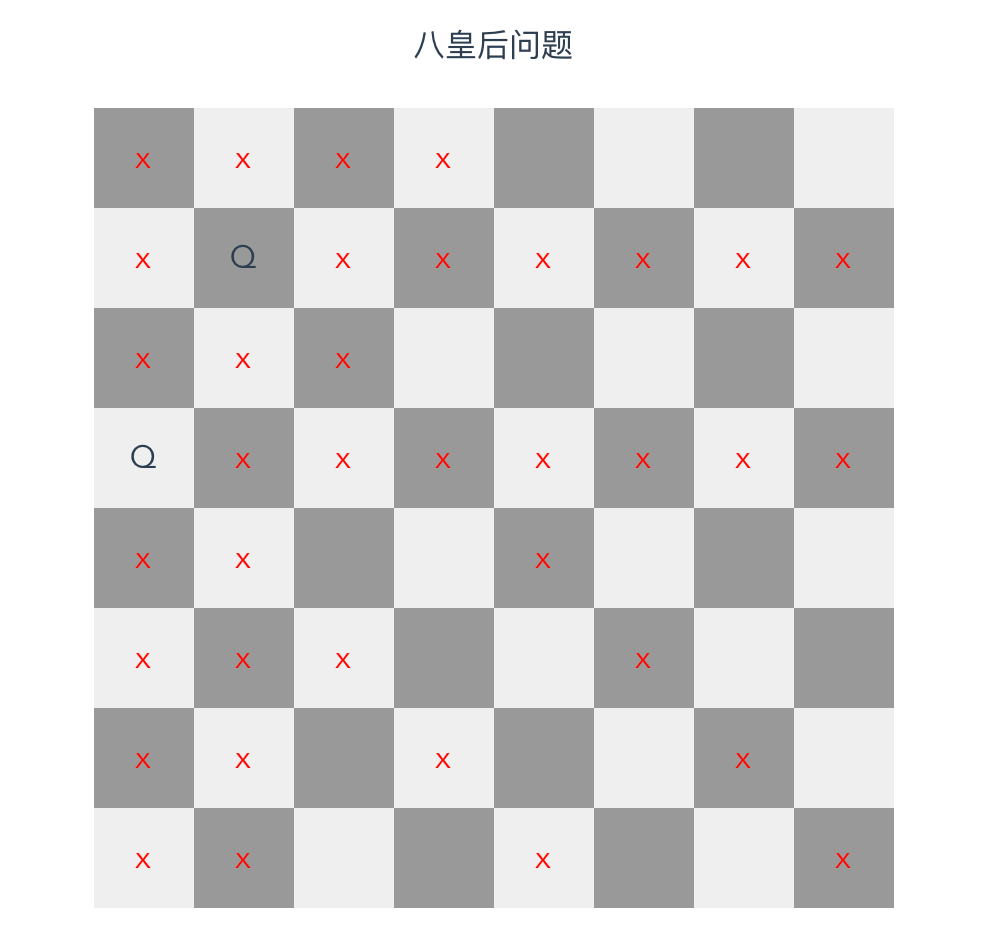

# 组件

\#网易云课堂#
\#高级前端开发工程师#
\#Vue#
\#初识 vue#
\#组件#
\#JavaScript#
\#js#
\#vue.js#

Vue.js 注册（全局注册、局部注册、全局导入、按需引入）、生命周期、动态组件（`<component>`、`<keep-alive>`）、八皇后问题（选择功能、失效网格功能）。

## 注册

### 全局注册

* [`Vue.component`](https://cn.vuejs.org/v2/api/#Vue-component)
* 能在任何地方使用
* 构建时会被构建进去，若未使用组件会造成浪费

### 局部注册

* `components`

```html
<script>
import ComponentA from '@/components/ComponentA'
export default {
  components: {
    ComponentA,
  },
}
</script>
```

* 只能在当前组件中使用

### 全局导入

* [`require.context`](https://www.webpackjs.com/guides/dependency-management/#require-context)
* 实例

```js
const requireComponent = require.context(
  './components', // 组件目录相对路径
  false,
  /Regist\w*\.(vue|js)$/,
)
requireComponent.keys().forEach((fileName) => {
  const componentConfig = requireComponent(fileName) // 配置
  // PascalCase
  const componentName = upperFirst(camelCase(
    // 去掉目录 获取文件名
    fileName.split('/').pop().replace(/\.\w+$/, '')
  ))
  Vue.component(
    componentName,
    componentConfig.default || componentConfig
  )
})
  ```

### 按需载入

* `babel-plugin-import`
* `babel-plugin-component` Element UI
* 作用
  
```js
import { Button } from 'components'
// ↓ 转换成
var button = require('components/lib/button')
require('components/lib/button/style.css')
```

## 生命周期


| 生命周期        | 使用场景                                                             |
| --------------- | ----------------------------------------------------------------  |
| `beforeCreate`  | 最初调用触发。`data`、events 不可用。用于处理 Loading。                 |
| `created`       | `data`、events 可用。可以发送请求。                                   |
| `beforeMount`   | 模板编译后，渲染出发前。SSR 中不可用。基本不用。                         |
| `mounted`       | 渲染后。DOM、`$ref` 可用。SSR 中不可用。用于 vue 中嵌入非 vue 组件时。    |
| `beforeUpdate`  | 数据改变后，模板改变前。使用计算属性、`watch` 监听。                     |
| `updated`       | 模板改变后。用于重新渲染后的大点、新能检测、触发 vue 组件中非 vue 组件更新。 |
| `beforeDestroy` | 组件卸载前。用于清理事件、计时器、取消订阅。                              |
| `destroyed`     | 组件卸载后。用于做最后的大点、事件触发。                                 |

* 实例

```html
<!-- /project/netease-study-senior-fe/vue-hello/src/components/LifeCycle.vue -->
<template>
  <div>
    LifeCycle {{ number }}
    <input
      type="number"
      ref="input"
      v-model="number"
    />
  </div>
</template>

<script>
export default {
  data() {
    return {
      number: 1,
    }
  },
  computed: {
    computed1() {
      return this.number * 2
    },
  },
  beforeCreate() {
    console.group('=== 初始化 ===');
    console.log('--- beforeCreate ---');

    console.log(` [data:number] ${this.number} `);
    console.log(` [computed:computed1] ${this.computed1} `);
    console.log(` [method:method1] ${this.method1} `);
    console.log(` [ref:input] ${this.$refs.input} `);
    console.log(` [root] ${this.$root} `);
    console.log(` [parent] ${this.$parent} `);

    console.log(``);
  },
  created() {
    console.log('--- created ---');

    console.log(` [data:number] ${this.number} `);
    console.log(` [computed:computed1] ${this.computed1} `);
    console.log(` [method:method1] ${this.method1} `);
    console.log(` [ref:input] ${this.$refs.input} `);
    console.log(` [root] ${this.$root} `);
    console.log(` [parent] ${this.$parent} `);

    console.groupEnd();
  },
  beforeMount() {
    console.group('=== 挂载 ===');
    console.log('--- beforeMount ---');
    console.log(` [ref:input] ${this.$refs.input} `);
    console.log(` [root] ${this.$root} `);
    console.log(` [parent] ${this.$parent} `);
  },
  mounted() {
    console.log('--- mounted ---');
    console.log(` [ref:input] ${this.$refs.input} `);
    console.log(` [root] ${this.$root} `);
    console.log(` [parent] ${this.$parent} `);

    console.groupEnd();
  },
  beforeUpdate() {
    console.group('=== 模板更新 ===');

    console.log('--- beforeUpdate ---');

    console.log(` number: ${this.number} `);
  },
  updated() {
    console.log('--- updated ---');

    console.log(` number: ${this.number} `);

    console.groupEnd();
  },
  activated() {
    console.group('=== keepAlive 激活 ===');
    console.log('--- activated ---');
  },
  deactivated() {
    console.log('--- deactivated ---');
    console.groupEnd();
  },
  beforeDestroy() {
    console.group('=== 销毁 ===');
    console.log('--- beforeDestory ---');
  },
  destroyed() {
    console.log('--- destoryed ---');

    console.groupEnd();
  },
  methods: {
    method1() {},
  },
}
</script>
```

```shell
# /project/netease-study-senior-fe/vue-hello
npm install
npm run serve
# 2.5 组件 生命周期
```

## 动态组件

* [`<component>`](https://cn.vuejs.org/v2/api/index.html#component)
  * `is` 渲染的组件
* [`<keep-alive>`](https://cn.vuejs.org/v2/api/index.html#keep-alive)
  * 缓存组件实例
  * Props
    * `vm.$el` 获得 DOM
    * `include` 字符串或正则表达式。只有名称匹配的组件会被缓存。
    * `exclude` 字符串或正则表达式。任何名称匹配的组件都不会被缓存。
    * `max` 数字。最多可以缓存多少组件实例。
  * 子组件生命周期钩子
    * `activated` `<keep-alive>` 缓存组件激活后调用
    * `deactivated` `<keep-alive>` 缓存组件停用后调用

```html
<!-- /project/netease-study-senior-fe/vue-hello/src/components/Dynamic.vue -->
<template>
  <div>
    dynamic
    <input
      type="text"
      v-model="text"
    />
  </div>
</template>

<script>
export default {
  data() {
    return {
      text: 'A',
    }
  },
}
</script>
```

```html
<!-- /project/netease-study-senior-fe/vue-hello/src/App.vue -->
<button @click="dynamic = !dynamic">切换动态组件</button>
<p>&lt;component&gt;</p>
<component :is="component"></component>

<button @click="keepAlive = !keepAlive">切换动态组件</button>
<p>&lt;keep-alive&gt;</p>
<keep-alive>
  <component :is="componentKeepAlive"></component>
</keep-alive>
```

```shell
# /project/netease-study-senior-fe/vue-hello
npm install
npm run serve
# 2.5 组件 动态组件
```

## 八皇后问题选择功能

```html
<!-- /project/netease-study-senior-fe/eight-queens/src/components/EightQueens.vue -->
<template>
  <div>
    <div class="title">八皇后问题</div>

    <div class="grid">
      <div class="row" v-for="(row, rIndex) in grids" :key="rIndex">
        <div class="col" v-for="(col, cIndex) in row" :key="col.key" @click="select(rIndex, cIndex)">
          <div v-show="col.selected">Q</div>
        </div>
      </div>
    </div>
  </div>
</template>

<script>
const grids = new Array(8).fill(0).map((v, r) => {
  return new Array(8).fill(0).map((v, c) => {
    return {
      key: `key-${r * 8 + c}`,
      selected: false,
    }
  })
})

export default {
  data() {
    return {
      grids,
    }
  },
  methods: {
    /**
     * 选择
     * @param {number} row 行索引
     * @param {number} col 列索引
     */
    select(row, col) {
      if (!this.validate(row, col)) { return alert('当前位置不能摆放皇后') }
      this.grids[row][col].selected = !this.grids[row][col].selected
    },
    /**
     * 验证
     * @param {number} row 行索引
     * @param {number} col 列索引
     * @return {boolean} 是否验证通过
     */
    validate(row, col) {
      // →
      for (let i = 0; i < this.grids[row].length; i++) {
        if (grids[row][i].selected) { return false }
      }
      // ↓
      for (let i = 0; i < this.grids.length; i++) {
        if (grids[i][col].selected) { return false }
      }
      // ↘
      for (let y = 0; y < this.grids.length; y++) {
        // y - x === row - col
        let x = y - row + col
        if (x >= 0 && x < this.grids[y].length && grids[y][x].selected) { return false }
      }
      // ↗
      for (let y = 0; y < this.grids.length; y++) {
        // y + x === row + col
        let x = row + col - y
        if (x >= 0 && x < this.grids[y].length && grids[y][x].selected) { return false }
      }
      return true
    },
  },
}
</script>

<style lang="stylus" scoped>
.grid
  margin-top: 20px
.row
  display: flex
  margin: 0 auto
  width: 400px
  height: 50px
  cursor: pointer
  &:nth-child(2n)
    .col
      &:nth-child(2n - 1)
        background: #efefef
      &:nth-child(2n)
        background: #999
.col
  flex: 1 1 50px
  text-align: center
  box-sizing: border-box
  width: 50px
  height: 50px
  line-height: 50px
  background: #999
  &:nth-child(2n)
    background: #efefef
</style>
```

```shell
# /project/netease-study-senior-fe/eight-queens
npm install
npm run serve
```

## 八皇后问题失效网格功能

```html
<!-- /project/netease-study-senior-fe/eight-queens/src/components/EightQueens.vue -->
<template>
  <div>
    <div class="title">八皇后问题</div>

    <div class="grid">
      <div
        class="row"
        v-for="(row, rIndex) in grids"
        :key="rIndex"
      >
        <div
          class="col"
          :class="{ 'col--disabled': !col.selected && col.disabled }"
          v-for="(col, cIndex) in row"
          :key="col.key"
          @click="select(rIndex, cIndex)"
        >
          <div v-show="col.selected">Q</div>
        </div>
      </div>
    </div>
  </div>
</template>

<script>
const grids = new Array(8).fill(0).map((v, r) => {
  return new Array(8).fill(0).map((v, c) => {
    return {
      key: `key-${r * 8 + c}`,
      selected: false, // 选中
      disabled: 0, // 失效计数
    }
  })
})

export default {
  data() {
    return {
      grids,
    }
  },
  methods: {
    /**
     * 选择
     * @param {number} row 行索引
     * @param {number} col 列索引
     */
    select(row, col) {
      // 未选择且失效
      if (!this.grids[row][col].selected && this.grids[row][col].disabled) {
        return alert('当前位置不能摆放皇后')
      }
      this.grids[row][col].selected = !this.grids[row][col].selected
      this.getRelatedGrid(row, col, (grid) => {
        this.grids[row][col].selected ? grid.disabled++ : grid.disabled--
      })
    },
    /**
     * 获取相关网格 调用回调函数
     * @param {number} row 行索引
     * @param {number} col 列索引
     * @param {Function} cb 回调函数 cb(grid, row, col)
     */
    getRelatedGrid(row, col, cb) {
      // →
      for (let i = 0; i < this.grids[row].length; i++) {
        cb(grids[row][i], row, i)
      }
      // ↓
      for (let i = 0; i < this.grids.length; i++) {
        cb(grids[i][col], i, col)
      }
      // ↘
      for (let y = 0; y < this.grids.length; y++) {
        // y - x === row - col
        let x = y - row + col
        if (x >= 0 && x < this.grids[y].length) { cb(grids[y][x], y, x) }
        
      }
      // ↗
      for (let y = 0; y < this.grids.length; y++) {
        // y + x === row + col
        let x = row + col - y
        if (x >= 0 && x < this.grids[y].length) { cb(grids[y][x], y, x) }
      }
    },
  },
}
</script>

<style lang="stylus" scoped>
.grid
  margin-top: 20px
.row
  display: flex
  margin: 0 auto
  width: 400px
  height: 50px
  cursor: pointer
  &:nth-child(2n)
    .col
      &:nth-child(2n - 1)
        background: #efefef
      &:nth-child(2n)
        background: #999
.col
  flex: 1 1 50px
  text-align: center
  box-sizing: border-box
  width: 50px
  height: 50px
  line-height: 50px
  background: #999
  &:nth-child(2n)
    background: #efefef
  &--disabled:after
    content: 'x'
    display block
    position display
    color: #f00
</style>
```

```shell
# /project/netease-study-senior-fe/eight-queens
npm install
npm run serve
```


