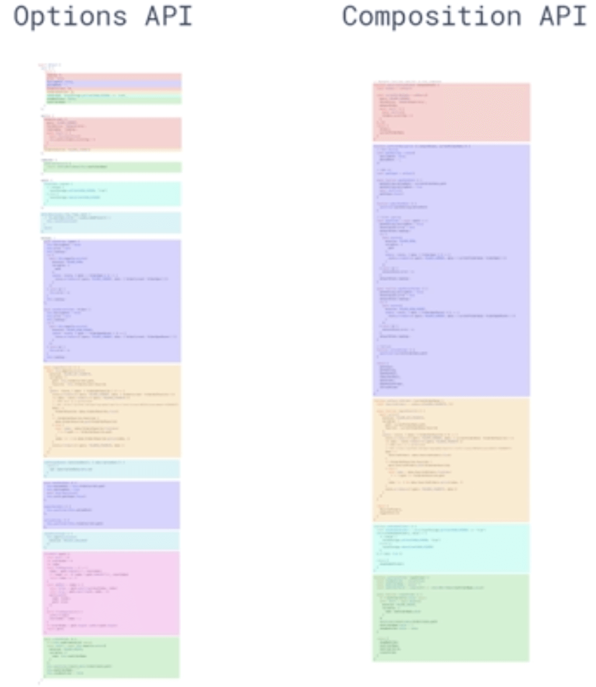

# vue 3 composition api

\#网易云课堂#
\#高级前端开发工程师#
\#Vue#
\#深入 vue 源码设计#
\#vue 3 composition api#
\#JavaScript#
\#js#
\#vue.js#

Vue.js Vue 3.0（创建 Vue 3.0 项目、特性）、Composition API (设计动机、`setup`、`reactive`、`ref`、`computed`、`watch`、生命周期钩子函数)、代码结构优化。

## Vue 3.0

### 创建 Vue 3.0 项目

```shell
npm upgrade -g @vue/cli
vue create vue-next-demo
cd vue-next-demo
vue add vue-next
```

### 特性

* 性能优化
* Tree-Shaking 支持
* Composition API
* Fragment、TelePort、Suspense
* TypeScript 支持
* 自定义 Renderer API

## Composition API

### 设计动机

* 逻辑组合复用
  * 解决模板中数据来源不清晰问题
  * 解决命名空间冲突问题
  * 解决性能问题
* 类型推导
  * 增强 TypeScript 支持
* 打包尺寸
  * 函数 API 对 Tree-Shaking 更友好

### [`setup`](https://composition-api.vuejs.org/zh/api.html#setup)

* 实例创建时，初始化 props 后调用
* 返回一个对象，其属性暴露给模板的渲染上下文

### [`reactive`](https://composition-api.vuejs.org/zh/api.html#reactive)

* 创建一个没有包装的响应式对象

### [`ref`](https://composition-api.vuejs.org/zh/api.html#ref)

* 返回一个包装对象（value reference）
* 包装对象只有一个属性 `.value`
* 意义能在函数间以引用方式传递任意类型值的容器

### [`computed`](https://composition-api.vuejs.org/zh/api.html#computed)

* 创建计算属性

### [`watch`](https://composition-api.vuejs.org/zh/api.html#watch)

* 参数1数据源
* 参数2回调函数，数据源发生改变触发

### [生命周期钩子函数](https://composition-api.vuejs.org/zh/api.html#%E7%94%9F%E5%91%BD%E5%91%A8%E6%9C%9F%E9%92%A9%E5%AD%90%E5%87%BD%E6%95%B0)

* ~~`beforeCreate`~~ -> 使用 `setup()`
* ~~`created`~~ -> 使用 `setup()`
* `beforeMount` -> `onBeforeMount`
* `mounted` -> `onMounted`
* `beforeUpdate` -> `onBeforeUpdate`
* `updated` -> `onUpdated`
* `beforeDestroy` -> `onBeforeUnmount`
* `destroyed` -> `onUnmounted`
* `errorCaptured` -> `onErrorCaptured`

## 代码结构优化



## 延伸

* [Vue 3.0 - github](https://github.com/vuejs/vue-next)
* [聊聊 Vue.js 3.0 Beta - 尤雨溪](https://www.bilibili.com/video/BV1Tg4y1z7FH)
* [Vue 3 Template Explorer](https://vue-next-template-explorer.netlify.app/)
* [Vue 3.0 Composition API RFC](https://composition-api.vuejs.org/zh/)
