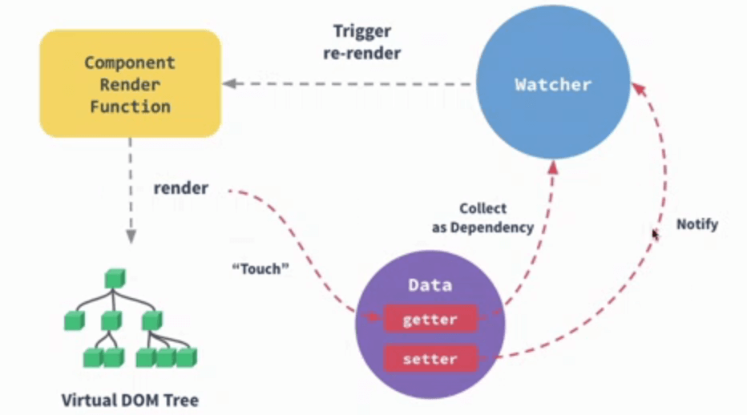

# 数据

\#网易云课堂#
\#高级前端开发工程师#
\#Vue#
\#初识 vue#
\#数据#
\#JavaScript#
\#js#
\#vue.js#

Vue.js Data、Prop、计算属性、侦听器、数组操作。



## [Data](https://cn.vuejs.org/v2/api/#data)

数据对象

```html
<script>
export default {
  data() {
    return {
      obj: {},
    }
  }
}
</script>
```

### `data` 为什么是函数

组件的 `data` 必须是函数以返回全新副本数据对象，否则将**共享引用**同一个数据对象

## [Prop](https://cn.vuejs.org/v2/api/#props)

接收来自父组件的数据

### 单向数据流

### Prop 属性校验

| 规则        | 备注                                                                                                                   |
| ----------- | --------------------------------------------------------------------------------------------------------------------- |
| `type`      | 1. 类型检查，值为对应类型的构造函数<br />2. `null`、`undefined` 会通过任何类型验证<br />3. 多种类型传入数组，如 `[String, Array]` |
| `required`  | 是否必填                                                                                                               |
| `default`   | 默认值，为对象、数组必须从工厂函数返回                                                                                      |
| `validator` | 自定义校验函数，返回 `true` 通过，返回 `false` 不通过                                                                       |

### 实例

```html
<!-- /src/components/PropParent.vue -->
<template>
  <div>
    <prop-child parent-name="banjino"></prop-child>
  </div>
</template>

<script>
import PropChild from './PropChild'

export default {
  components: {
    PropChild,
  },
}
</script>
```

```html
<!-- /src/components/PropChild.vue -->
<template>
  <div>father {{ parentName }}</div>
</template>

<script>
export default {
  // Array<Object>
  // props: ['parentName'],
  // Object
  props: {
    parentName: {
      type: String,
      required: true,
      default: 'banjino',
      validator(value) {
        const nameEnums = ['banjino', 'sam']
        return nameEnums.includes(value)
      },
    }
  },
  mounted() {
    // [Vue warn] 不建议直接修改 props
    // Vue.js 是单向数据流的
    // this.parentName = 'a' 
  },
}
</script>
```

```shell
# /project/netease-study-senior-fe/vue-hello
npm install
npm run serve
# 2.3 数据 props
```

## [计算属性](https://cn.vuejs.org/v2/api/#computed)

* 计算属性
  * 基于其内部的**响应式依赖**进行缓存
  * 只在相关**响应式依赖发生改变**时才重新计算
* 方法
  * 无缓存
  * 每当触发重新渲染时，调用方法将**总会再次**执行方法

```html
<!-- /src/components/Computed.vue -->
<template>
  <div>
    <div v-for="(classmate, index) in classmates" :key="classmate.id">
      {{ index }}.{{ classmate.name }}:{{ classmate.count }}
      <button @click="add(index)">+</button>
      <button @click="subtract(index)">-</button>
    </div>
    <div>computed total: {{ cTotal }}</div>
    <div>method total: {{ mTotal() }}</div>
    <button @click="rerender">rerender {{ random }}</button>
  </div>
</template>

<script>
export default {
  data() {
    return {
      // 同学
      classmates: [
        { id: 1, name: 'Han Meimei', count: 0 }, // 编号 名称 计数
        { id: 2, name: 'Li Lei', count: 0 },
        { id: 3, name: 'Lily', count: 0 },
      ],
      random: 0, // 随机数
    }
  },
  computed: {
    /**
     * 计算属性总计数
     */
    cTotal() {
      console.log('cTotal')
      return this.classmates.reduce((acc, cur) => acc + cur.count, 0)
    },
  },
  methods: {
    /**
     * 加
     * @param {number} 索引
     */
    add(i) {
      this.classmates[i].count++
    },
    /**
     * 减
     * @param {number} 索引
     */
    subtract(i) {
      this.classmates[i].count--
    },
    /**
     * 方法总计数
     */
    mTotal() {
      console.log('mTotal')
      return this.classmates.reduce((acc, cur) => acc + cur.count, 0)
    },
    /**
     * 重新渲染
     */
    rerender() {
      this.random = (Math.random() * 100).toFixed(0)
    },
  }
}
</script>
```

```shell
# /project/netease-study-senior-fe/vue-hello
npm install
npm run serve
# 2.3 数据 computed
```

## [侦听器](https://cn.vuejs.org/v2/api/index.html#watch)

* 监听数据变化
* 用途：在数据变化后执行**异步操作**、**开销较大的操作**

```html
<!-- /src/components/Watch.vue -->
<template>
  <div>
    {{ count }}
    <button @click="count++">add</button>
  </div>
</template>

<script>
export default {
  data() {
    return {
      count: 0,
    }
  },
  watch: {
    count() {
      console.log(this.count)
    }
  }
}
</script>
```

```shell
# /project/netease-study-senior-fe/vue-hello
npm install
npm run serve
# 2.3 数据 watch
```

## 数组操作

```html
<!-- /src/components/Array.vue -->
<template>
  <div>
    <div v-for="(classmate, index) in classmates" :key="classmate.id">
      {{ index }}.{{ classmate.name }}
      <button @click="add(index)">+</button>
      <button @click="subtract(index)">-</button>
    </div>
    <button @click="change">change</button>
  </div>
</template>

<script>
export default {
  data() {
    return {
      // 同学
      classmates: [
        { id: 1, name: 'Han Meimei' }, // 编号 名称
        { id: 2, name: 'Li Lei' },
        { id: 3, name: 'Lily' },
      ],
    }
  },
  methods: {
    /**
     * 改变同学
     * 没有变化
     */
    change() {
      this.classmates[2] = { id: 4, name: 'Wang' }
      console.log(this.classmates)
    },
  }
}
</script>
```

调用 `change` 方法后并没有变化

### [`Object.defineProperty`](https://developer.mozilla.org/zh-CN/docs/Web/JavaScript/Reference/Global_Objects/Object/defineProperty)

* Vue.js 数据响应式实现原理  
  `Object.defineProperty` 将数据属性装换成 `getter`、`setter` 完成追踪依赖，在属性变化时进行通知  
* 局限性
  * 不能检测**对象**属性**添加**、**删除**
  * 不能检测**数组长度变化**
  * 出于性能考量，不会监听数组每个元素
* 解决方法
  * [`Vue.set()`](https://cn.vuejs.org/v2/api/index.html#Vue-set)
  * [`vm.$set`](https://cn.vuejs.org/v2/api/index.html#vm-set)
  * [`Vue.delete()`](https://cn.vuejs.org/v2/api/index.html#Vue-delete)
  * [`vm.$delete`](https://cn.vuejs.org/v2/api/index.html#vm-delete)
  * Vue.js 对函数方法做了代理处理
    * Array.push()
    * Array.pop()
    * Array.shift()
    * Array.unshift()
    * Array.splice()
    * Array.sort()
    * Array.reverse()

```html
<!-- /src/components/Array.vue -->
<script>
import Vue from 'vue'

export default {
  data() {
    return {
      // 同学
      classmates: [
        { id: 1, name: 'Han Meimei' }, // 编号 名称
        { id: 2, name: 'Li Lei' },
        { id: 3, name: 'Lily' },
      ],
    }
  },
  methods: {
    /**
     * 改变同学
     * 没有变化
     */
    change() {
      this.classmates[2] = { id: 4, name: 'Wang' }
      console.log(this.classmates)
    },
    /**
     * 添加同学
     */
    add() {
      // Vue.set(this.classmates, '3', { id: 4, name: 'Lucy' })
      this.classmates.push({ id: 4, name: 'Lucy' })
    },
    /**
     * 设置同学
     */
    set() {
      Vue.set(this.classmates, '3', { id: 4, name: 'Wang' })
    },
    /**
     * 删除同学
     */
    remove() {
      Vue.delete(this.classmates, '3')
    },
  }
}
</script>
```

```shell
# /project/netease-study-senior-fe/vue-hello
npm install
npm run serve
# 2.3 数据 array
```
