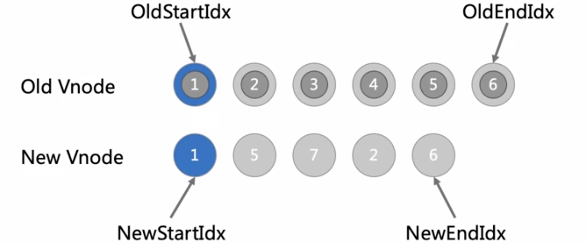

# diff patch

\#网易云课堂#
\#高级前端开发工程师#
\#Vue#
\#深入 vue 源码设计#
\#diff patch#
\#JavaScript#
\#js#
\#vue.js#

Vue.js Virtual DOM、Diff & Patch（策略、图解）。

## Virtual DOM

* Virtual DOM
  * js 对象，至少包含 tag、props、children
* 优点
  * Virtual DOM diff patch 操作提高开发效率，而非应用性能
  * 实现跨平台渲染

## Diff & Patch

### Diff 策略

1. 按 tree 层级 diff（level by level）
1. 按类型 diff
1. 列表 diff

### Diff 图解

* 大圈为 VNode 
* 小圈为 DOM
* （n）对应图片 title

1. 比较 OldStartIdx、NewStartIdx，相同（1）  
   OldStartIdx、NewStartIdx +1  
   进入下一回合

   

1. 比较 OldStartIdx、NewStartIdx，不同（2）  
   比较 OldEndIdx、NewEndIdx，相同（3）  
   OldEndIdx、NewEndIdx -1  
   进入下一回合

   
   

1. 比较 OldStartIdx、NewStartIdx，不同（4）  
   比较 OldEndIdx、NewEndIdx，不同（5）  
   比较 OldStartIdx、NewEndIdx，相同（6）  
   移动 OldStartIdx 指向的 VNode 的 DOM 插入到 OldEndIdx 指向的 VNode 的 DOM 后（7）  
   OldStartIdx +1、NewEndIdx -1  
   进入下一回合

   
   
   
   

1. 比较 OldStartIdx、NewStartIdx，不同（8）  
   比较 OldEndIdx、NewEndIdx，不同（9）  
   比较 OldStartIdx、NewEndIdx，不同（10）  
   比较 OldEndIdx、NewStartIdx，相同（11）  
   移动 OldEndIdx 指向的 VNode 的 DOM 插入到 OldStartIdx 指向的 VNode 的 DOM 后（12）  
   OldEndIdx -1、NewStartIdx +1
   进入下一回合

   
   
   
   
   

1. 比较 OldStartIdx、NewStartIdx，不同（13）  
   比较 OldEndIdx、NewEndIdx，不同（14）  
   比较 OldStartIdx、NewEndIdx，不同  
   比较 OldEndIdx、NewStartIdx，不同  
   遍历 OldStartIdx、OldStartIdx 间节点是否存在与 NewStartIdx 相同的节点，若存在则将移动 DOM 到 OldStartIdx 指向的 VNode 的 DOM 前插入，没有存在则创建 NewStartIdx 指向的 VNode 的 DOM 在 OldStartIdx 前插入  
   若设置 `key` 属性，首先寻找 `key` 对应 VNode
   NewEndIdx -1（15）  
   此时 NewEndIdx < NewStartIdx，说明 New VNode 生成完毕  
   删除 Old VNode 多余部分 OldStartIdx、OldEndIdx 指向 VNode 及中间部分（16）  
   通过 Old VNode 生成 DOM 并销毁

   
   
   
   

* 设置 `key`
  * 算法复杂度 O(n)
* 未设置
  * 算法复杂度
    * 最好 O(n)
    * 最坏 O($n^2$)
