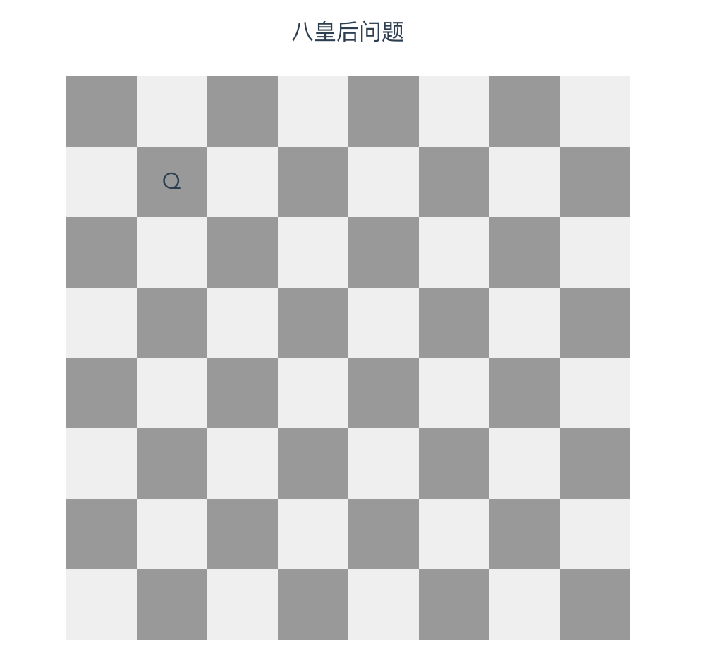

# 事件 & 样式

\#网易云课堂#
\#高级前端开发工程师#
\#Vue#
\#初识 vue#
\#事件 & 样式#
\#JavaScript#
\#js#
\#vue.js#

Vue.js 事件（`v-on:`、`@`、修饰符、自定义事件）、样式。

## 事件

### [`v-on:`、`@`](https://cn.vuejs.org/v2/api/#v-on) 绑定事件监听器

```html
<!-- /src/components/Event.vue -->
<template>
  <div>
    {{ count }}
    <button @click="add(2, $event)">add 2</button>
  </div>
</template>

<script>
export default {
  data() {
    return {
      count: 0, // 计数
    }
  },
  methods: {
    /**
     * 增加
     * @param {number}  number  数字
     * @param {Object}  event   事件
     */
    add(num, event) {
      this.count += num
      console.log('num: ', num)
      console.log('event: ', event)
      console.log('event instanceof MouseEvent: ', event instanceof MouseEvent)
    }
  },
}
</script>
```

```shell
# /project/netease-study-senior-fe/vue-hello
npm install
npm run serve
# 2.4 事件 & 样式 事件
```

### 修饰符

* 修饰符  
  保证 `methods` 方法只有纯粹的数据逻辑、与 DOM 解耦、易于单元测试、不做 DOM 相关操作
  * `.stop`  
    调用 `event.stopPropagation()`  
    组织事件传播
  * `.prevent`  
    调用 `event.preventDefault()`  
    阻止默认行为
  * `.capture`  
    添加事件侦听器时使用 capture 模式  
    即内部元素触发的事件先在此处理，然后才交由内部元素进行处理
  * `.self`  
    只当事件是从侦听器绑定的元素本身触发时才触发
  * `.once`  
    只触发一次
  * `.passive` <Badge text="2.3.0+"/>  
    以 { passive: true } 模式添加侦听器  
    立即触发默认行为
  * `.{keyCode | keyAlias}`  
    特定键触发时触发
  * 能串联使用

### 自定义事件

* [`vm.$emit()`](https://cn.vuejs.org/v2/api/index.html#vm-emit)

```html
<!-- /src/components/EmitParent.vue -->
<template>
  <div>
    {{ msg }}
    <emit-child
      :msg="msg"
      @update:msg="msg = $event"
    ></emit-child>
    <emit-child
      :msg.sync="msg"
    ></emit-child>
  </div>
</template>

<script>
import EmitChild from './EmitChild'

export default {
  components: {
    EmitChild,
  },
  data() {
    return {
      msg: 'parent',
    }
  },
}
</script>
```

```html
<!-- /src/components/EmitChild.vue -->
<template>
  <div>
    <button @click="$emit('update:msg', 'hi')">
      say {{ msg }}
    </button>
  </div>
</template>

<script>
export default {
  props: ['msg'],
}
</script>
```

* 实现了“双向绑定”
* 语法糖 `.sync` 修饰符

```shell
# /project/netease-study-senior-fe/vue-hello
npm install
npm run serve
# 2.4 事件 & 样式 $emit
```

## 样式

* class
  * `:class`
    * 对象语法  
      `:class="{ class1: var1, class2: var2 }"`、`:class="classObj"`
    * 数组语法  
      `:class="[ 'class1', 'class2' ]"`
* style
  * `:style`
    * 对象语法  
      `:style="{ 'width': ${width} + 'px' }"`、`:style="styleObj"`  
      属性名遵循 camelCase、kebab-case
* 命名方式
  * [BEM](https://bemcss.com/)
    * `block-name__element-name--modifier-name`
* [css scoped](https://vue-loader.vuejs.org/zh/guide/scoped-css.html)

## 实例

```html
<!-- /project/netease-study-senior-fe/eight-queens/src/components/EightQueens.vue -->
<template>
  <div>
    <div class="title">八皇后问题</div>

    <div class="grid">
      <div class="row" v-for="(row, rIndex) in grids" :key="rIndex">
        <div class="col" v-for="(col, cIndex) in row" :key="col.key" @click="select(rIndex, cIndex)">
          <div v-show="col.selected">Q</div>
        </div>
      </div>
    </div>
  </div>
</template>

<script>
const grids = new Array(8).fill(0).map((v, r) => {
  return new Array(8).fill(0).map((v, c) => {
    return {
      key: `key-${r * 8 + c}`,
      selected: false,
    }
  })
})

export default {
  data() {
    return {
      grids,
    }
  },
  methods: {
    /**
     * 选择
     * @param {number} row 行索引
     * @param {number} col 列索引
     */
    select(row, col) {
      grids[row][col].selected = !grids[row][col].selected
    },
  },
}
</script>

<style lang="stylus" scoped>
.grid
  margin-top: 20px
.row
  display: flex
  margin: 0 auto
  width: 400px
  height: 50px
  cursor: pointer
  &:nth-child(2n)
    .col
      &:nth-child(2n - 1)
        background: #efefef
      &:nth-child(2n)
        background: #999
.col
  flex: 1 1 50px
  text-align: center
  width: 50px
  height: 50px
  line-height: 50px
  background: #999
  &:nth-child(2n)
    background: #efefef
</style>
```

```shell
# /project/netease-study-senior-fe/eight-queens
npm install
npm run serve
```

