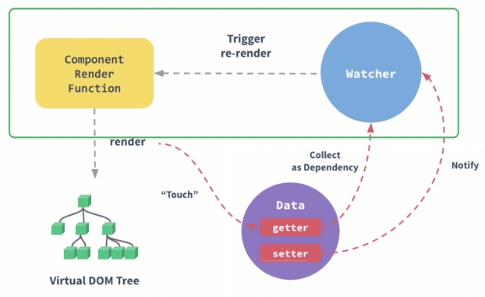

# 异步更新队列（nextTick）源码分析

\#网易云课堂#
\#高级前端开发工程师#
\#Vue#
\#深入 vue 源码设计#
\#异步更新队列（nextTick）源码分析#
\#JavaScript#
\#js#
\#vue.js#

Vue.js 异步更新原理、nextTick。



## 异步更新原理

### 异步更新队列

```shell
# /project/netease-study-senior-fe/vue-hello
npm install
npm run serve
# 4.2 异步更新队列（nextTick）源码分析 多组数据响应式
```

* 当模板中存在多处变量依赖时，每一个变量修改都会导致渲染。如何优化？

```html
<!-- /project/netease-study-senior-fe/vue-hello/src/components/NextTick.vue -->
<template>
  <div>
    <p id="next-tick"></p>
  </div>
</template>

<script>
export default {
  mounted() {
    let x, y, z
    const container = document.querySelector('#next-tick')

    let active
    class Dependence {
      constructor() {
        this.deps = new Set()
      }
      depend() {
        active && this.deps.add(active)
      }
      notify() {
        this.deps.forEach((dep) => addQueue(dep))
      }
    }
    const ref = (initValue) => {
      let value = initValue
      let dep = new Dependence()
      return Object.defineProperty({}, 'value', {
        get() {
          dep.depend()
          return value
        },
        set(newValue) {
          value = newValue
          dep.notify()
        },
      })
    }
    const watch = (cb) => {
      active = cb
      active()
      active = null
    }
    let queue = []
    const addQueue = (task) => {
      if (!queue.includes(task)) {
        queue.push(task)
        nextTick(executeQueue)
      }
    }
    const executeQueue = () => {
      let task
      while (queue.length > 0) {
        task = queue.shift()
        task && task()
      }
    }
    const nextTick = (cb) => Promise.resolve().then(cb)

    x = ref(1)
    y = ref(2)
    z = ref(3)
    watch(() => {
      let str = `x: ${x.value}, y: ${y.value}, z: ${z.value}`
      console.log(`[next tick] ${str}`)
      container.innerText = `${container.innerText} | ${str}`
    })
    x.value = 4
    y.value = 5
    z.value = 6
  },
}
</script>
```

```shell
# /project/netease-study-senior-fe/vue-hello
npm install
npm run serve
# 4.2 异步更新队列（nextTick）源码分析 异步更新队列
```

## nextTick

* [`Vue.nextTick`](https://cn.vuejs.org/v2/api/#Vue-nextTick)
* [`vm.$nextTick`](https://cn.vuejs.org/v2/api/#vm-nextTick)
* 在下次 DOM 更新循环结束之后执行延迟回调
* 用于修改数据后，在回调中获得更新后的 DOM