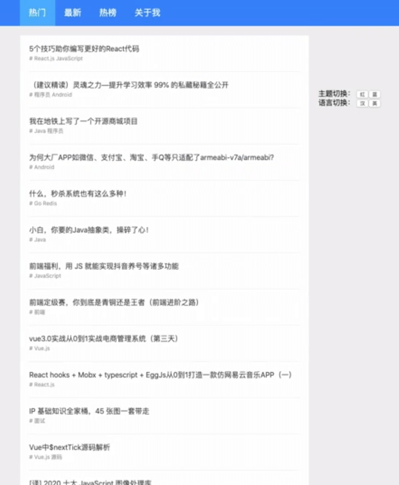
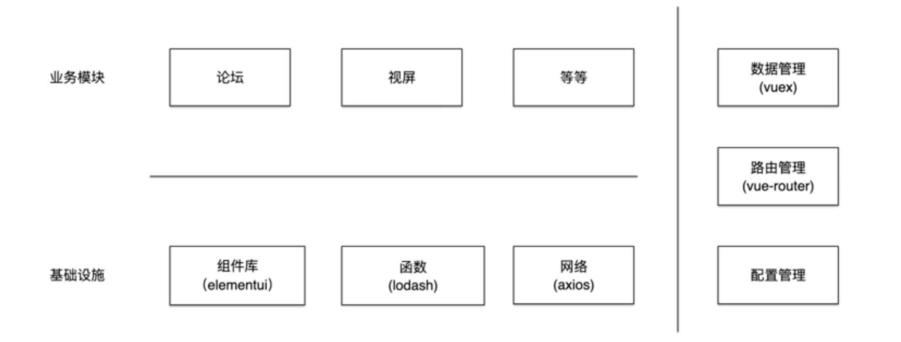

# 掘金 Top 10 列表页实践

\#网易云课堂#
\#高级前端开发工程师#
\#Vue# 
\#vue 生态及实践#
\#掘金 Top 10 列表页实践#
\#JavaScript#
\#js#
\#vue.js#

Vue 掘金 Top 10 列表页实践 预览、架构、起步、文件结构、Vuex、业务、Vue Router。

## 预览



## 架构



## 起步

```shell
# 模板文件 解压
# /project/netease-study-senior-fe/juejin-demo-boilerplate.zip
npm install
# yarn
npm run dev
# yarn dev
# http://localhost:3000/
```

## 文件结构

```
/
├─ build
│  ├─ setup-dev-server.js
│  ├─ webpack.base.config.js
│  └─ webpack.client.config.js
├─ public
├─ src
│  ├─ directive
│  ├─ module
│  │  └─ topic 体现高内聚低耦合
│  │     ├─ api
│  │     ├─ components
│  │     └─ views
│  ├─ util
│  ├─ app.js 应用单例
│  ├─ app.vue 根组件
│  └─ index.template.html
├─ package.json
└─ server.js
```

## CORS 跨域问题

```js {6}
// /project/netease-study-senior-fe/juejin-demo/server.js
app.get("*", (req, res) => {
  serverReady.then((clientCompiler) => {
    clientCompiler.outputFileSystem.readFile(HTML_FILE, (err, result) => {
      if (err) {
        return next(err);
      }
      res.set("content-type", "text/html");
      res.send(result);
      res.end();
    });
  });
});
```

## Vuex

```js
// /project/netease-study-senior-fe/juejin-demo/src/module/topic/store.js
import { fetchItems } from './api/api'

export const TYPES = {
  HOT: 'hot',
  NEW: 'new',
  TOP: 'top',
}

export const store = {
  namespaced: true,
  state: {
    activeType: TYPES.HOT,
    hot: {
      items: [],
      pageInfo: {},
    },
    new: {
      items: [],
      pageInfo: {},
    },
    top: {
      items: [],
      pageInfo: {},
    },
  },
  mutations: {
    SET_ACTIVE_TYPE: (state, { type }) => {
      state.activeType = type
    },
    SET_ITEMS: (state, { items, pageInfo }) => {
      items.forEach((item) => item && state[state.activeType].items.push(item))
      state[state.activeType].pageInfo = pageInfo
    },
  },
  actions: {
    FETCH_ITEMS: ({ commit, state }, { type }) => {
      commit('SET_ACTIVE_TYPE', { type })
      const after = state[type].pageInfo.endCursor || ''
      return fetchItems({ type, after })
        .then(({ items, pageInfo }) => commit('SET_ITEMS', { items, pageInfo }))
    },
  },
}
```

```js
// /project/netease-study-senior-fe/juejin-demo/src/store.js
import Vue from 'vue'
import Vuex from 'vuex'
import { store as topic } from './module/topic/store'

Vue.use(Vuex)

export default new Vuex.Store({
  modules: {
    topic,
  }
})
```

```js {3,7}
// /project/netease-study-senior-fe/juejin-demo/src/app.js
import Vue from 'vue'
import store from './store'
import App from './App.vue'

const app = new Vue({
  store,
  render: (h) => h(App),
})

app.$mount('#app')
```

## 业务

```js {3,7}
// /project/netease-study-senior-fe/juejin-demo/src/app.js
import Vue from 'vue'
import intersect from './directive/intersect'
import store from './store'
import App from './App.vue'

Vue.directive('intersect', intersect)

...
```

```html {6}
<!-- /project/netease-study-senior-fe/juejin-demo/src/App.vue -->
<template>
  <div>
    <div class="m-top"></div>
    <div class="m-content">
      <u-topic type="hot"></u-topic>
    </div>
  </div>
</template>

...
```

```html
<!-- /project/netease-study-senior-fe/juejin-demo/src/module/topic/views/UTopic.vue -->
<template>
  <div>
    <u-list :items="items"></u-list>
    <div class="x-bottom" v-intersect="{ handler: fetchNext }"></div>
  </div>
</template>

<script>
import { createNamespacedHelpers } from 'vuex'
const { mapState, mapActions } = createNamespacedHelpers('topic')
import UList from './../components/UList.vue'

export default {
  name: 'u-top',
  components: {
    UList, 
  },
  props: ['type'],
  computed: {
    ...mapState({
      items: (state) => state[state.activeType].items,
    }),
  },
  created() {
    this.fetchNext()
  },
  methods: {
    ...mapActions({
      fetchItems: 'FETCH_ITEMS',
    }),
    fetchNext() {
      this.fetchItems({ type: this.type })
    },
  },
}
</script>

<style scoped>
.x-bottom {
  height: 40px;
  background: #333;
}
</style>
```

## Vue Router

```js
// /project/netease-study-senior-fe/juejin-demo/src/module/topic/router.js
import { TYPES } from './store'

export const routes = [{
  name: TYPES.HOT,
  path: `/${TYPES.HOT}`,
  component: () => import('./views/UTopic.vue'),
  props: { type: TYPES.HOT }
}, {
  name: TYPES.NEW,
  path: `/${TYPES.NEW}`,
  component: () => import('./views/UTopic.vue'),
  props: { type: TYPES.NEW }
}, {
  name: TYPES.TOP,
  path: `/${TYPES.TOP}`,
  component: () => import('./views/UTopic.vue'),
  props: { type: TYPES.TOP }
}]
```

```js
// /project/netease-study-senior-fe/juejin-demo/src/router.js
import Vue from 'vue'
import VueRouter from 'vue-router'
import { routes as topic } from './module/topic/router'

Vue.use(VueRouter)

export default new VueRouter({
  routes: [
    ...topic,
    { path: '/', redirect: '/hot' }
  ],
})
```

```js {5,12}
// /project/netease-study-senior-fe/juejin-demo/src/app.js
import Vue from 'vue'
import intersect from './directive/intersect'
import store from './store'
import router from './router'
import App from './App.vue'

Vue.directive('intersect', intersect)

const app = new Vue({
  store,
  router,
  render: (h) => h(App),
})

app.$mount('#app')
```

```html
<!-- /project/netease-study-senior-fe/juejin-demo/src/App.vue -->
<template>
  <div>
    <div class="m-top">
      <router-link class="m-link" v-for="nav in navs" :key="nav.path" :to="nav.path">{{ nav.name }}</router-link>
    </div>
    <div class="m-content">
      <router-view></router-view>
    </div>
  </div>
</template>

<script>
import { TYPES } from './module/topic/store'

export default {
  computed: {
    navs() {
      return [
        { name: '热门', path: TYPES.HOT },
        { name: '最新', path: TYPES.NEW },
        { name: '热榜', path: TYPES.TOP },
      ]
    },
  },
}
</script>

<style>
...

.m-link {
  display: inline-block;
  padding: 0 20px;
  height: 60px;
  line-height: 60px;
  font-size: 19px;
  color: #fff;
}
  .m-link.router-link-active {
     background: #00a6ff;
  }

...
</style>
```

```html
<!-- /project/netease-study-senior-fe/juejin-demo/src/module/topic/views/UTopic.vue -->
...

<script>
...

export default {
  ...

  watch: {
    type() {
      this.fetchNext()
    },
  },
  
  ...
}
</script>
```

```shell
# /project/netease-study-senior-fe/juejin-demo
npm install
npm run dev
# http://localhost:3000/
```
