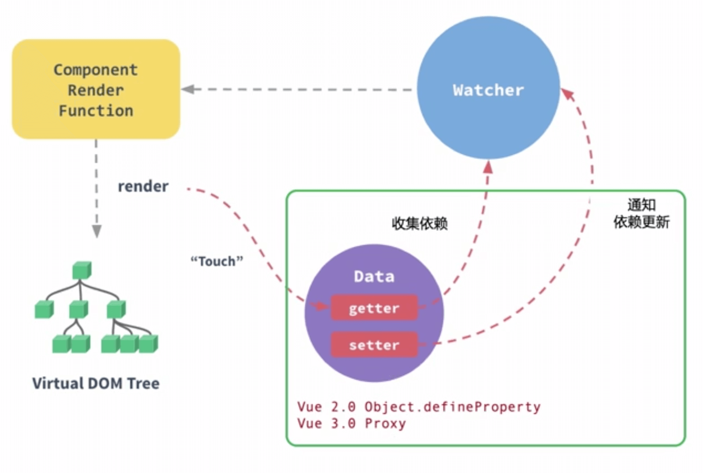

# 响应式

\#网易云课堂#
\#高级前端开发工程师#
\#Vue#
\#深入 vue 源码设计#
\#响应式#
\#JavaScript#
\#js#
\#vue.js#

Vue.js 响应式概念、实现。

## 概念

* 面向数据流和变化传播的编程范式
* 编程语言中更方便的表达静态或动态的数据流，相关的计算模型会自动将变化的值通过数据流进行传播

```js
let x
let y
const f = (n) => n * 100 + 100
x = 1
y = f(x) // 200
x = 2
y = f(x) // 300
x = 3
y = f(x) // 400
```

↓ 自动化

```js
let x
let y
const f = (n) => n * 100 + 100
const onXChanged = (cb) => {...}
onXChanged(() => {
  y = f(x)
})
x = 1
x = 2
x = 3
```

响应到页面

```js
onXChanged(() => {
  document.querySelector('#Content').innerText = `content${f(x)}`
})
```



* Vue 2.0 Object.defineProperty
* Vue 3.0 Proxy

## 实现

```html
<!-- /project/netease-study-senior-fe/vue-hello/src/components/Responsive.vue -->
<template>
  <div>
    <p id="responsive"></p>
  </div>
</template>

<script>
export default {
  mounted() {
    let x, y
    const fn = (n) => n * 100 + 100
    const container = document.querySelector('#responsive')

    let active
    class Dependence {
      constructor() {
        this.deps = new Set()
      }
      depend() {
        active && this.deps.add(active)
      }
      notify() {
        this.deps.forEach((dep) => dep())
      }
    }
    const ref = (initValue) => {
      let value = initValue
      let dep = new Dependence()
      return Object.defineProperty({}, 'value', {
        get() {
          dep.depend()
          return value
        },
        set(newValue) {
          value = newValue
          dep.notify()
        },
      })
    }
    const onXChange = (cb) => {
      active = cb
      active()
      active = null
    }

    x = ref(1)
    onXChange(() => {
      y = fn(x.value)
      console.log(y)
      container.innerText = `${container.innerText}, y: ${y}`
    })
    x.value = 2
    x.value = 3
  },
}
</script>
```

```shell
# /project/netease-study-senior-fe/vue-hello
npm install
npm run serve
# 4.1 响应式
```
