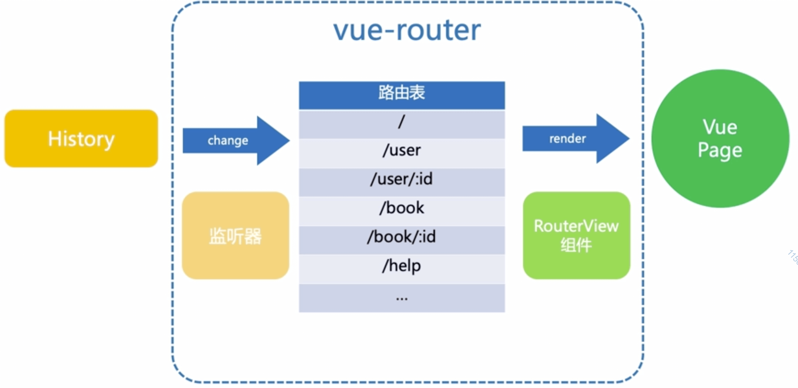

# vue router 上

\#网易云课堂#
\#高级前端开发工程师#
\#Vue# 
\#vue 生态及实践#
\#vue router 上#
\#JavaScript#
\#js#
\#vue.js#

Vue Router 路由、Vue Router、Hash Mode、HTML5 Mode、实例、实现（Vue Router、RouterView、RouterLink）。

## 路由

* 路由（routing）  
  通过互联网将信息从源地址传输到目的地址的活动

## Vue Router

* 路由表

| 路由表     |
| --------- |
| /         |
| /user     |
| /user/:id |
| /book     |
| /book/:id |
| /help     |
| ...       |



## Hash Mode

```js
// http://www.xxx.com#/hashtag
location.hash // #/hashtag
```

* 监听 [`window.onhashchange`](https://developer.mozilla.org/zh-CN/docs/Web/API/Window/onhashchange) 事件
* 触发
  * 修改 `location.hash`

## HTML5 Mode

* 监听 [`window.onpopstate`](https://developer.mozilla.org/zh-CN/docs/Web/API/Window/onpopstate) 事件
* 触发
  * 点击浏览器后退
  * `history.back()`、`history.forward()`、`history.go()`
* `history.pushState()`、`history.replaceState()` 增加、替换历史栈但不触发 `window.onpopstate`

## 实例

```shell
npm install vue-router --save
```

```js
// /project/netease-study-senior-fe/vue-hello/src/main.js
import Vue from 'vue'
import App from '@/App.vue'
import { Input } from 'element-ui'
import mixin from '@/mixins/mixin'
import router from '@/router'
import store from '@/store'

Vue.config.productionTip = false

Vue.use(Input)

Vue.mixin(mixin)

new Vue({
  router,
  store,
  render: h => h(App)
}).$mount('#app')
```

```js
// /project/netease-study-senior-fe/vue-hello/src/router/index.js
import Vue from 'vue'
import Router from 'vue-router'
import Bar from '@/pages/Bar'
import Foo from '@/pages/Foo'

Vue.use(Router)

export default new Router({
  routes: [
    { path: '/bar', components: { vueRouterDemo: Bar } },
    { path: '/foo', components: { vueRouterDemo: Foo } },
  ],
})
```

```html
<!-- /project/netease-study-senior-fe/vue-hello/src/pages/Bar.vue -->
<template>
  <div>Bar</div>
</template>
```

```html
<!-- /project/netease-study-senior-fe/vue-hello/src/pages/Foo.vue -->
<template>
  <div>Foo</div>
</template>
```

```html
<!-- /project/netease-study-senior-fe/vue-hello/src/components/Router.vue -->
<template>
  <div>
    <router-link to="/bar">Bar</router-link>
    <router-link to="/foo">Foo</router-link>
    <router-view name="vueRouterDemo"></router-view>
  </div>
</template>
```

```shell
# /project/netease-study-senior-fe/vue-hello
npm install
npm run serve
# 5.3 vue router 上 vue router
```

## 实现（Vue Router、RouterView、RouterLink）

```js {3,4}
// /project/netease-study-senior-fe/vue-hello/src/router/index.js
import Vue from 'vue'
// import Router from 'vue-router'
import Router from '@/utils/router'
import Bar from '@/pages/Bar'
import Foo from '@/pages/Foo'

Vue.use(Router)

export default new Router({
  routes: [
    { path: '/bar', components: { vueRouterDemo: Bar } },
    { path: '/foo', components: { vueRouterDemo: Foo } },
  ],
})
```

```js
// /project/netease-study-senior-fe/vue-hello/src/utils/router.js
import Vue from 'vue'
import MyRouterView from '@/components/MyRouterView'
import MyRouterLink from '@/components/MyRouterLink'
import Html5Mode from './history/html5'

Vue.component(MyRouterView.name, MyRouterView)
Vue.component(MyRouterLink.name, MyRouterLink)

class RouterTable {
  constructor(routes) {
    this._pathMap = new Map()
    this.init(routes)
  }
  init(routes) {
    const addRoute = (route) => {
      this._pathMap.set(route.path, route)
    }
    routes.forEach((route) => addRoute(route))
  }
  match(path) {
    for (const key of this._pathMap.keys()) {
      if (key === path) {
        return this._pathMap.get(key)
      }
    }
  }
}

export default class Router {
  constructor({ routes }) {
    this.routerTable = new RouterTable(routes)
    this.history = new Html5Mode(this)
    this.afterEach = function () {}
  }
  init(app) {
    const { history } = this
    history.listen((route) => {
      app._route = route
    })
    history.transitionTo(history.getCurrentLocation())
  }
  push(to) {
    this.history.push(to)
  }
}

Router.install = function () {
  Vue.mixin({
    beforeCreate() {
      if (this.$options.router !== undefined) {
        this._routerRoot = this
        this._router = this.$options.router
        this._router.init(this)
        Vue.util.defineReactive(this, '_route', this._router.history.current)
      } else {
        this._routerRoot = this.$parent && this.$parent._routerRoot
      }
    },
  })
}
```

```js
// /project/netease-study-senior-fe/vue-hello/src/utils/history/base.js
export default class BaseHistory {
  constructor({ routerTable }) {
    this.routerTable = routerTable
  }
  listen(hook) {
    this.hook = hook
  }
  transitionTo(target) {
    const route = this.routerTable.match(target)
    this.current = route
    this.hook(this.current)
  }
}
```

```js
// /project/netease-study-senior-fe/vue-hello/src/utils/history/hash.js
import BaseHistory from './base'

export default class HashHistory extends BaseHistory {
  constructor(options) {
    super(options)
  }
  push(target) {
    super.transitionTo(target)
    location.hash = target
  }
}
```

```js
// /project/netease-study-senior-fe/vue-hello/src/utils/history/html5.js
import BaseHistory from './base'

export default class Html5History extends BaseHistory {
  constructor(options) {
    super(options)
    this.initListener()
  }
  initListener() {
    window.addEventListener('popstate', () => {
      super.transitionTo(this.getCurrentLocation())
    })
  }
  getCurrentLocation() {
    return decodeURI(window.location.pathname) || '/' + window.location.search + window.location.hash;
  }
  push(target) {
    super.transitionTo(target)
    window.history.pushState({ key: +new Date() }, '', target)
  }
}
```

```html
<!-- /project/netease-study-senior-fe/vue-hello/src/components/MyRouter.vue -->
<template>
  <div>
    <my-router-link to="/bar">Bar</my-router-link>
    <my-router-link to="/foo">Foo</my-router-link>
    <my-router-view name="vueRouterDemo"></my-router-view>
  </div>
</template>
```

```html
<!-- /project/netease-study-senior-fe/vue-hello/src/components/MyRouterLink.vue -->
<template>
  <a @click="jump">
    <slot></slot>
  </a>
</template>

<script>
export default {
  name: 'MyRouterLink',
  props: {
    to: {
      type: String,
      required: true,
    }
  },
  methods: {
    jump() {
       const router = this._routerRoot._router
       router.push(this.to)
    },
  },
}
</script>
```

```html
<!-- /project/netease-study-senior-fe/vue-hello/src/components/MyRouterView.vue -->
<script>
export default {
  name: 'MyRouterView',
  props: ['name'],
  render() {
    const route = this._routerRoot._route
    if (!route) {
      return
    }
    let component = {}
    if (route.component) {
      component = route.component
    }
    if (this.name && route.components && route.components[this.name]) {
      component = route.components[this.name]
    }
    return <component />
  },
}
</script>
```

```shell
# /project/netease-study-senior-fe/vue-hello
npm install
npm run serve
# 5.3 vue router 上 实现 vue router
```
