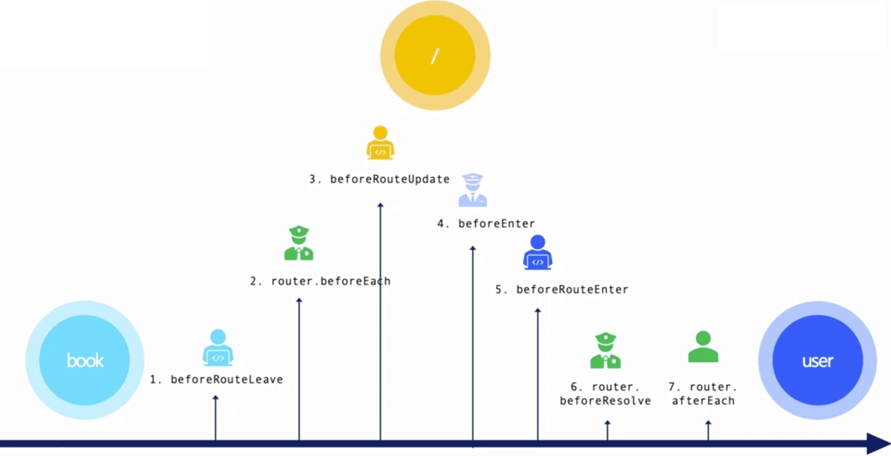

# vue router 下

\#网易云课堂#
\#高级前端开发工程师#
\#Vue# 
\#vue 生态及实践#
\#vue router 下#
\#JavaScript#
\#js#
\#vue.js#

Vue Router 导航守卫（分类、解析流程）、实例、实现。

## [导航守卫](https://router.vuejs.org/zh/guide/advanced/navigation-guards.html)

* 路由变化时的拦截器，能阻止跳转等其他功能

### 分类

* 全局守卫
  * [`beforeEach`](https://router.vuejs.org/zh/guide/advanced/navigation-guards.html#%E5%85%A8%E5%B1%80%E5%89%8D%E7%BD%AE%E5%AE%88%E5%8D%AB)
  * [`beforeResolve`](https://router.vuejs.org/zh/guide/advanced/navigation-guards.html#%E5%85%A8%E5%B1%80%E8%A7%A3%E6%9E%90%E5%AE%88%E5%8D%AB)
  * [`afterEach`](https://router.vuejs.org/zh/guide/advanced/navigation-guards.html#%E5%85%A8%E5%B1%80%E5%90%8E%E7%BD%AE%E9%92%A9%E5%AD%90)
* 路由独享守卫
  * [`beforeEnter`](https://router.vuejs.org/zh/guide/advanced/navigation-guards.html#%E8%B7%AF%E7%94%B1%E7%8B%AC%E4%BA%AB%E7%9A%84%E5%AE%88%E5%8D%AB)
* [组件内守卫](https://router.vuejs.org/zh/guide/advanced/navigation-guards.html#%E7%BB%84%E4%BB%B6%E5%86%85%E7%9A%84%E5%AE%88%E5%8D%AB)
  * `beforeRouteEnter`
  * `beforeRouteUpdate` <Badge text="2.2.0+"/>
  * `beforeRouteLeave`

### 解析流程



### 实例

```js {3,4}
// /project/netease-study-senior-fe/vue-hello/src/router/index.js
import Vue from 'vue'
import Router from 'vue-router'
// import Router from '@/utils/router'
import Bar from '@/pages/Bar'
import Foo from '@/pages/Foo'

Vue.use(Router)

const router = new Router({
  routes: [{
    path: '/bar',
    components: { vueRouterDemo: Bar },
    beforeEnter(to, from, next) {
      console.log('[bar.beforeEnter]', to, from)
      next()
    },
  }, {
    path: '/foo',
    components: { vueRouterDemo: Foo },
    beforeEnter(to, from, next) {
      console.log('[foo.beforeEnter]', to, from)
      next()
    },
  }],
})

router.beforeEach((to, from, next) => {
  console.log('[router.beforeEach]', to, from)
  next()
})

router.beforeResolve((to, from, next) => {
  console.log('[router.beforeResolve]', to, from)
  next()
})

router.afterEach((to, from) => {
  console.log('[router.afterEach]', to, from)
})

export default router
```

```html
<!-- /project/netease-study-senior-fe/vue-hello/src/pages/Bar.vue -->
<template>
  <div>Bar</div>
</template>

<script>
export default {
  beforeRouteEnter(to, from, next) {
    console.log('[Bar.beforeRouteEnter]', to, from)
    next()
  },
  beforeRouteUpdate(to, from, next) {
    console.log('[Bar.beforeRouteUpdate]', to, from)
    next()
  },
  beforeRouteLeave(to, from, next) {
    console.log('[Bar.beforeRouteLeave]', to, from)
    next()
  },
}
</script>
```

```html
<!-- /project/netease-study-senior-fe/vue-hello/src/pages/Foo.vue -->
<template>
  <div>Foo</div>
</template>

<script>
export default {
  beforeRouteEnter(to, from, next) {
    console.log('[Foo.beforeRouteEnter]', to, from)
    next()
  },
  beforeRouteUpdate(to, from, next) {
    console.log('[Foo.beforeRouteUpdate]', to, from)
    next()
  },
  beforeRouteLeave(to, from, next) {
    console.log('[Foo.beforeRouteLeave]', to, from)
    next()
  },
}
</script>
```

```html
<!-- /project/netease-study-senior-fe/vue-hello/src/components/Guard.vue -->
<template>
  <div>
    <router-link to="/bar">Bar</router-link>
    <router-link to="/foo">Foo</router-link>
    <router-view name="vueRouterDemo"></router-view>
  </div>
</template>
```

```shell
# /project/netease-study-senior-fe/vue-hello
npm install
npm run serve
# 5.4 vue router 下 导航守卫
```

## 实现

```js {3,4}
// /project/netease-study-senior-fe/vue-hello/src/router/index.js
import Vue from 'vue'
// import Router from 'vue-router'
import Router from '@/utils/router'
import Bar from '@/pages/Bar'
import Foo from '@/pages/Foo'

...
```

```js
// /project/netease-study-senior-fe/vue-hello/src/utils/router.js
import Vue from 'vue'
import MyRouterView from '@/components/MyRouterView'
import MyRouterLink from '@/components/MyRouterLink'
import Html5Mode from './history/html5'

Vue.component(MyRouterView.name, MyRouterView)
Vue.component(MyRouterLink.name, MyRouterLink)

class RouterTable {
  constructor(routes) {
    this._pathMap = new Map()
    this.init(routes)
  }
  init(routes) {
    const addRoute = (route) => {
      this._pathMap.set(route.path, route)
    }
    routes.forEach((route) => addRoute(route))
  }
  match(path) {
    for (const key of this._pathMap.keys()) {
      if (key === path) {
        return this._pathMap.get(key)
      }
    }
  }
}

export default class Router {
  constructor({ routes }) {
    this.routerTable = new RouterTable(routes)
    this.history = new Html5Mode(this)
    this.beforeHooks = []
    this.resolveHooks = []
    this.afterHooks = []
  }
  init(app) {
    const { history } = this
    history.listen((route) => {
      app._route = route
    })
    history.transitionTo(history.getCurrentLocation())
  }
  push(to) {
    this.history.push(to)
  }
  beforeEach(fn) {
    return registerHook(this.beforeHooks, fn)
  }
  beforeResolve(fn) {
    return registerHook(this.resolveHooks, fn)
  }
  afterEach(fn) {
    return registerHook(this.afterHooks, fn)
  }
}

Router.install = function () {
  Vue.mixin({
    beforeCreate() {
      if (this.$options.router !== undefined) {
        this._routerRoot = this
        this._router = this.$options.router
        this._router.init(this)
        Vue.util.defineReactive(this, '_route', this._router.history.current)
      } else {
        this._routerRoot = this.$parent && this.$parent._routerRoot
      }
    },
  })
}

function registerHook(list, fn) {
  list.push(fn)
  return () => {
    if (list.includes(fn)) {
      list.splice(list.indexOf(fn), 1)
    }
  }
}
```

```js
// /project/netease-study-senior-fe/vue-hello/src/utils/async.js
export function runQueue(queue, iterator, end) {
  step(0)

  function step(index) {
    if (index >= queue.length) { return end && end() }
    if (!queue[index]) { return step(index + 1) }
    iterator(queue[index], () => { step(index + 1) })
  }
}
```

```js
// /project/netease-study-senior-fe/vue-hello/src/utils/history/base.js
import { runQueue } from '@/utils/async'

export default class BaseHistory {
  constructor(router) {
    this.router = router
    this.routerTable = router.routerTable
  }
  listen(hook) {
    this.hook = hook
  }
  transitionTo(target) {
    const route = this.routerTable.match(target)
    this.confirmTransition(route, () => this.updateRoute(route))
  }
  confirmTransition(route, onComplete, onAbort) {
    if (route === this.current) { return }

    const iterator = (hook, next) => {
      hook(route, this.current, (to) => {
        if (to === false) { return onAbort && onAbort(to) }
        next(to)
      })
    }
    runQueue([
      ...this.router.beforeHooks,
      route.beforeEnter,
      // TODO route components 逻辑
      route.components.vueRouterDemo && route.components.vueRouterDemo.beforeRouteEnter.bind(route.instance),
      ...this.router.resolveHooks,
    ], iterator, () => onComplete())
  }
  updateRoute(route) {
    const from = this.current
    this.current = route
    this.hook(this.current)
    this.router.afterHooks.forEach((hook) => hook && hook(this.current, from))
  }
}
```

```html
<!-- /project/netease-study-senior-fe/vue-hello/src/components/MyRouterView.vue -->
<script>
export default {
  name: 'MyRouterView',
  props: ['name'],
  render() {
    const route = this._routerRoot._route
    if (!route) {
      return
    }
    let component = {}
    if (route.component) {
      component = route.component
    }
    if (this.name && route.components && route.components[this.name]) {
      component = route.components[this.name]
    }
    const hook = {
      init(vnode) {
        route.instance = vnode.componentInstance
        console.log('[MyRouterView] vnode: ', vnode)
        console.log('[MyRouterView] route.instance: ', route.instance)
      }
    }
    return <component hook={hook} />
  },
}
</script>
```

```html
<!-- /project/netease-study-senior-fe/vue-hello/src/components/MyGuard.vue -->
<template>
  <div>
    <my-router-link to="/bar">Bar</my-router-link>
    <my-router-link to="/foo">Foo</my-router-link>
    <my-router-view name="vueRouterDemo"></my-router-view>
  </div>
</template>
```

```shell
# /project/netease-study-senior-fe/vue-hello
npm install
npm run serve
# 5.4 vue router 下 实现导航守卫
```
