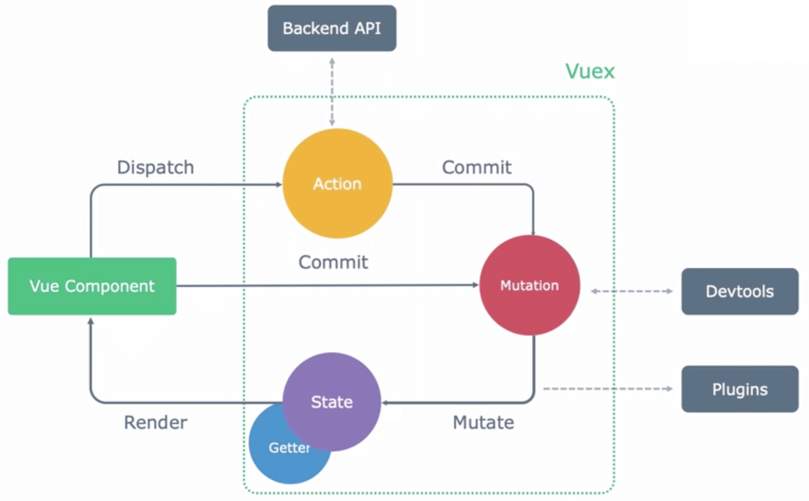

# vuex 上

\#网易云课堂#
\#高级前端开发工程师#
\#Vue#
\#vue 生态及实践#
\#vuex 上#
\#JavaScript#
\#js#
\#vue.js#

Vuex 背景、概念、API。

## Vuex

### 背景

* Vue 2.0 是**单向数据流**的
* 父组件 - prop -> 子组件
* 父组件 <- $emit - 子组件
* 兄弟组件需要通过父组件传递数据  
  复杂场景下开发效率过高
* `$parent`、`$root` 耦合程度高，不利于复用

### 概念

* 使用**单一状态树**
* [State](https://vuex.vuejs.org/zh/guide/state.html)
  * 唯一数据源 store 实例
  * 与 vue 实例 `data` 遵循相同规则
  * 响应式的
  * vue 实例通过 `computed` 返回 Vuex 的值
* [Getter](https://vuex.vuejs.org/zh/guide/getters.html)
  * 类似 store 的 `computed` 计算属性  
  * 根据依赖缓存，依赖值发生该变才会重新计算
* [Mutation](https://vuex.vuejs.org/zh/guide/mutations.html)
  * 更改 Vuex store 中的状态唯一方法
  * 由 `commit` 触发
  * 同步操作
* [Action](https://vuex.vuejs.org/zh/guide/actions.html)
  * 由 `dispatch` 触发
  * 异步操作
  * 通过 Mutation 改变状态



## API

### Vuex.Store 实例方法

* [`commit`](https://vuex.vuejs.org/zh/api/#commit)  
  提交 mutation
* [`dispatch`](https://vuex.vuejs.org/zh/api/#commit)
  分发 action

### 组件绑定的辅助函数

* [`mapState`](https://vuex.vuejs.org/zh/api/#mapstate)
  * 创建计算属性以返回 Vuex store 中状态
* [`mapGetters`](https://vuex.vuejs.org/zh/api/#mapgetters)
  * 创建计算属性以返回 getter 返回值
* [`mapMutations`](https://vuex.vuejs.org/zh/api/#mapmutations)
  * 创建组件方法提交 mutation
* [`mapActions`](https://vuex.vuejs.org/zh/api/#mapactions)
  * 创建组件方法分发 action

## 实例

```shell
vue add vuex
```

```js
import Vue from 'vue'
import Vuex from 'vuex'

Vue.use(Vuex)

export default new Vuex.Store({
  state: {
    count: 0,
  },
  getters: {
    doubleCount: (state) => state.count * 2
  },
  mutations: {
    addCount(state, payload = 1) {
      state.count += payload
    }
  },
  actions: {
    asyncAddCount({ commit }) {
      setTimeout(() => {
        commit('addCount')
      }, 1000)
    }
  },
  modules: {
  }
})
```

```html
<!-- /project/netease-study-senior-fe/vue-hello/src/components/VuexCountChild.vue -->
<template>
  <div>
    <button @click="addCount(3)">add 3</button>
    <button @click="asyncAddCount">async add</button>
  </div>
</template>

<script>
import { mapMutations, mapActions } from 'vuex'

export default {
  methods: {
    // addCount() {
    //   this.$store.commit('addCount', 3)
    // },
    ...mapMutations(['addCount']),
    // asyncAddCount() {
    //   this.$store.dispatch('asyncAddCount')
    // },
    ...mapActions(['asyncAddCount']),
  },
}
</script>
```

```html
<!-- /project/netease-study-senior-fe/vue-hello/src/components/VuexCount.vue -->
<template>
  <div>
    <vuex-count-child></vuex-count-child>
    {{ count }}|{{ countAlias }}|{{ doubleCount }}
  </div>
</template>

<script>
import VuexCountChild from './VuexCountChild'
import { mapState, mapGetters } from 'vuex'

export default {
  components: {
    VuexCountChild,
  },
  computed: {
    // count() {
    //   return this.$store.state.count
    // },
    ...mapState({
      count: (state) => state.count,
      countAlias: 'count',
    }),
    // doubleCount() {
    //   return this.$store.getters.doubleCount
    // },
    ...mapGetters(['doubleCount']),
  },
}
</script>
```

```shell
# /project/netease-study-senior-fe/vue-hello
npm install
npm run serve
# 5.1 vuex 上
```
